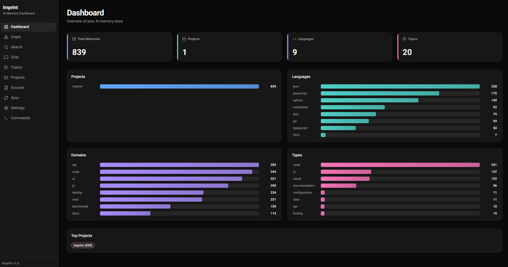
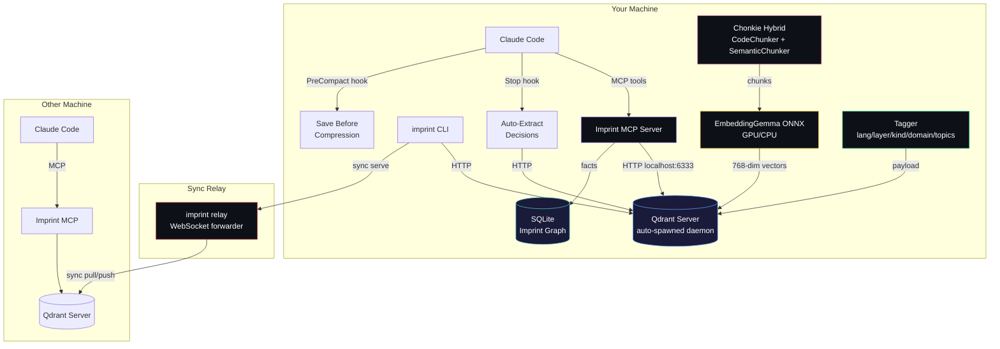

<p align="center">
  
</p>

<h1 align="center">Imprint</h1>

<p align="center">
  <strong>Persistent memory for AI coding tools. 100% local. Zero API cost.</strong>
</p>

<p align="center">
  Give Claude Code, Cursor, Codex CLI, Copilot, and Cline a long-term memory.<br/>
  Stop re-explaining your codebase every session.
</p>

<p align="center">
  <a href="https://imprintmcp.alexandruleca.com"><strong>imprintmcp.alexandruleca.com →</strong></a>
</p>

<p align="center">
  <a href="https://github.com/alexandruleca/imprint-memory-layer/actions/workflows/ci.yml"></a>
  <a href="https://github.com/alexandruleca/imprint-memory-layer/releases/latest"></a>
  <a href="LICENSE"></a>
  
  
</p>

---



### Why Imprint

- **Remembers what your AI forgets.** Decisions, patterns, bug fixes, and architectural choices persist across sessions — searched semantically, not grepped.
- **−70.4% tokens, −31.7% cost.** Measured across 150 runs on Claude Code (Sonnet). Your AI searches memory instead of re-reading files. See [BENCHMARK.md](BENCHMARK.md) for raw numbers.
- **Runs 100% locally by default.** EmbeddingGemma-300M via ONNX, Qdrant vector DB, Chonkie chunking — all on your machine. No API credits consumed unless you opt in.
- **One command, any host.** Wires into Claude Code, Cursor, Codex CLI, Copilot, or Cline via MCP. Same memory, shared across tools.

**Runs 100% locally. Zero API credits consumed by default.** Everything from embeddings, chunking, tagging, vector search, and the knowledge graph — runs on your machine:

- **Embeddings**: EmbeddingGemma-300M via ONNX Runtime (GPU or CPU), no network calls, no per-token cost.
- **Vector store**: Qdrant auto-spawned as a local daemon on `127.0.0.1:6333`. Your data never leaves the box unless you sync it to another device.
- **Chunking**: Chonkie hybrid (tree-sitter CodeChunker + SemanticChunker), pure Python, local.
- **Tagging**: deterministic rules + zero-shot cosine similarity against pre-embedded labels. Local LLM call per chunk if you want it.
- **Imprint graph**: SQLite on disk for temporal facts.

The ingestion flow: scan dir → detect project → chunk files → embed chunks → tag (lang/layer/kind/domain/topics) → upsert into Qdrant. A Stop hook auto-extracts decisions from Claude transcripts; a PreCompact hook saves context before window compression. Search goes straight to the local vector DB — no round-trip to any provider.

**Optional cloud LLM tagging** is opt-in only (`imprint config set tagger.llm true`) if you want more granular topics and are fine spending credits. Providers: Anthropic, OpenAI, Gemini, or fully-local Ollama / vLLM. Leave it off and nothing ever talks to a paid API.



## Quick Install

**Linux / macOS:**
```bash
curl -fsSL https://raw.githubusercontent.com/alexandruleca/imprint-memory-layer/main/install.sh | bash
```

**Windows (PowerShell):**
```powershell
irm https://raw.githubusercontent.com/alexandruleca/imprint-memory-layer/main/install.ps1 | iex
```

Pin a specific version, pick the dev channel, or use prebuilt Docker images — see [docs/installation.md](docs/installation.md).

## Updating

Once installed, use the built-in updater — no curl, no sudo. `data/` (workspaces, Qdrant storage, SQLite graphs, config, `gpu_state.json`) and `.venv/` are always preserved; only the code tree is replaced.

```bash
imprint update              # latest stable, asks for confirmation
imprint update --dev        # latest prerelease
imprint update --version v0.3.1
imprint update --check      # show current + latest release and exit
imprint update -y           # skip confirmation (CI / scripts)
```

Re-running `install.sh` also works and now prompts before overwriting an existing install. For non-interactive upgrades pass `--yes` or set `IMPRINT_ASSUME_YES=1`.

**If GPU setup fails once** (e.g. Blackwell + old nvcc, or CUDA runtime mismatch) the failure is remembered in `data/gpu_state.json` so future `imprint setup` runs skip the broken path silently. After you upgrade the toolchain, force a retry with:

```bash
imprint setup --retry-gpu
```

## Supported hosts

`imprint setup <target>` auto-wires the MCP server into each supported AI coding tool. Run `imprint setup all` to configure every host that's installed on your machine; missing tools are skipped with a warning, not an error.

| Target        | Wired into                                         | Config file                                                                           | Enforcement         |
|---------------|-----------------------------------------------------|----------------------------------------------------------------------------------------|---------------------|
| `claude-code` | Claude Code CLI (MCP + hooks + global `CLAUDE.md`) | `~/.claude/settings.json` + MCP registered via `claude mcp add`                        | Hard (PreToolUse)   |
| `cursor`      | Cursor IDE (MCP + always-on rule)                  | `~/.cursor/mcp.json` + `~/.cursor/rules/imprint.mdc`                                   | Text-only (rule)    |
| `codex`       | OpenAI Codex CLI                                   | `~/.codex/config.toml` (`[mcp_servers.imprint]`)                                       | Text-only           |
| `copilot`     | GitHub Copilot (VSCode agent mode), user-global    | `<VSCode user>/mcp.json` (`servers.imprint`)                                           | Text-only           |
| `cline`       | Cline — VSCode extension + standalone CLI          | `<VSCode user>/globalStorage/saoudrizwan.claude-dev/settings/cline_mcp_settings.json` and/or `~/.cline/data/settings/cline_mcp_settings.json` | Text-only |

`imprint disable` is symmetric — it tears down the MCP entry from every config file above that still exists (the venv and data are always preserved so re-enabling is fast).

## Commands

```bash
imprint setup [target]     # install deps, register MCP, configure the chosen host tool
                           #   target: claude-code (default) | cursor | codex | copilot | cline | all
                           # add --retry-gpu to forget a sticky GPU failure and retry ORT / llama-cpp CUDA
imprint update [--version v0.3.1] [--dev] [-y] [--check]
                           # upgrade imprint in place; preserves data/ and .venv/
imprint uninstall [-y] [--keep-data]
                           # full removal: disable + strip CLAUDE.md + delete venv/data/install dir
imprint status             # is everything wired? show enabled/disabled, server pid, memory stats
imprint enable [target]    # re-wire MCP + hooks + start server
                           #   target: claude-code | cursor | codex | copilot | cline | all
imprint disable            # stop server, unregister MCP from every host, strip Claude hooks (data preserved)
imprint ingest <path>      # index project source files (directory or single file)
imprint learn              # index Claude Code conversations + memory files
imprint learn --desktop    # also ingest Claude Desktop / ChatGPT Desktop export zips from Downloads
imprint ingest-url <url>   # fetch URL(s), extract content, and index (html/pdf/etc)
imprint refresh <dir>      # re-index only changed files (mtime-based)
imprint refresh-urls       # re-check stored URLs via ETag/Last-Modified and re-index changed
imprint retag [--project] [--all]
                           # re-run the tagger on existing memories (--all re-tags already-tagged chunks)
# Heavy jobs (ingest/refresh/retag/ingest-url/refresh-urls) serialize via a
# shared queue lock. If another job is already running the CLI exits with an
# error — cancel it from /queue in the UI or kill the PID it reports.
imprint migrate --from WS1 --to WS2 --project NAME | --topic TAG [--dry-run]
                           # move memories between workspaces (preserves vectors)
imprint config             # show all settings with current values
imprint config set <k> <v> # persist a setting (e.g. model.name, qdrant.port)
imprint config get <key>   # show one setting with source + default
imprint config reset <key> # remove override, revert to default
imprint server <cmd>       # manage the local Qdrant daemon: start | stop | status | log
imprint workspace          # list workspaces and show active
imprint workspace switch <name>  # switch to workspace (creates if new)
imprint workspace delete <name>  # delete a workspace and its data
imprint wipe [--force]     # wipe active workspace
imprint wipe --all         # wipe everything (all workspaces)
imprint sync serve [--relay <host>]      # expose KB for peer syncing (default: imprint.alexandruleca.com)
imprint sync <id> --pin <pin>            # sync via default relay (or <host>/<id> / wss://<host>/<id>)
imprint sync export | import <dir>       # snapshot bundle, no re-embed on import
imprint relay              # run the sync relay server
imprint ui [start|stop|status|open|restart|log] [--port N]
                           # dashboard (FastAPI + Next.js); bare `imprint ui` runs foreground
imprint version            # print version
```

## Documentation

| Topic | File |
|---|---|
| Install, versioning, channels, Docker | [docs/installation.md](docs/installation.md) |
| Components, data flow, Qdrant daemon, lifecycle | [docs/architecture.md](docs/architecture.md) |
| Embedding pipeline + GPU acceleration | [docs/embeddings.md](docs/embeddings.md) |
| Chunking strategy + tunables | [docs/chunking.md](docs/chunking.md) |
| Metadata tags, LLM providers, search filters | [docs/tagging.md](docs/tagging.md) |
| Workspaces + project detection | [docs/workspaces.md](docs/workspaces.md) |
| MCP tools + automatic updates | [docs/mcp.md](docs/mcp.md) |
| Peer sync, relay server, dashboard | [docs/sync.md](docs/sync.md) |
| Command queue + cancellation | [docs/queue.md](docs/queue.md) |
| All settings (`imprint config`) | [docs/configuration.md](docs/configuration.md) |
| Building from source + CI/release flow | [docs/building.md](docs/building.md) |
| Benchmarks & token savings | [BENCHMARK.md](BENCHMARK.md) |

## Glossary

Terms used across the docs.

| Term | Definition |
|---|---|
| **Chunk** | A sub-file unit of text (a function, class, markdown section, conversation turn) that gets its own embedding vector. Produced by the chunker. |
| **Embedding** | Dense numeric vector (default 768-dim) representing the semantic meaning of a chunk. Similar meanings → nearby vectors. |
| **Qdrant** | The vector database that stores embeddings + payloads. Runs as an auto-spawned local daemon on `127.0.0.1:6333`. |
| **Collection** | Qdrant's term for a named set of vectors. Each workspace has its own collection (e.g. `memories`, `memories_research`). |
| **Workspace** | Isolated memory environment — dedicated Qdrant collection + SQLite DB + WAL. Lets you separate research/staging/prod memories. |
| **Imprint Graph** | Temporal fact store (SQLite) for structured `subject → predicate → object` facts with `valid_from` / `ended` timestamps. |
| **MCP** | Model Context Protocol — the open protocol Claude Code uses to call external tools. Imprint ships an MCP server with 12 tools — see [docs/mcp.md](docs/mcp.md). |
| **Project** | A codebase identified by a canonical name from its manifest (`package.json`, `go.mod`, etc.). Projects get the same identity across machines even if paths differ. |
| **Layer** | Path-derived tag: `api`, `ui`, `tests`, `infra`, `config`, `migrations`, `docs`, `scripts`, `cli`. |
| **Kind** | Filename-derived tag: `source`, `test`, `migration`, `readme`, `types`, `module`, `qa`, `auto-extract`. |
| **Domain** | Content-derived tag from keyword regex: `auth`, `db`, `api`, `math`, `rendering`, `ui`, `testing`, `infra`, `ml`, `perf`, `security`, `build`, `payments`. |
| **Topics** | Free-form tags from zero-shot cosine similarity or (opt-in) LLM classification — more granular than `domain`. |
| **Ingestion** | Scanning a directory, detecting projects, chunking files, embedding chunks, tagging, and upserting into Qdrant. |
| **Refresh** | Incremental re-ingest — only re-chunks + re-embeds files whose mtime changed since last run. |
| **Queue** | Single-slot FIFO (`data/queue.sqlite3` + `data/queue.lock`) that serializes ingest/refresh/retag/ingest-url so parallel runs can't OOM the box. UI at `/queue` lists active + queued + history; cancel propagates SIGTERM→SIGKILL to the subprocess's process group, so in-flight LLM tagger calls die with it. See [docs/queue.md](docs/queue.md). |
| **Auto-extract** | Stop hook that parses conversation transcripts after each Claude response and stores Q+A exchanges + decision-like statements. |
| **PreCompact hook** | Synchronous hook that fires before Claude's context window compresses — instructs Claude to save important context via MCP tools first. |
| **Relay server** | Stateless WebSocket forwarder (`imprint relay`) that brokers peer sync between two machines. No vectors cross the wire — only raw content, re-embedded locally on the receiver. |
| **WAL** | Write-ahead log — append-only `wal.jsonl` per workspace, used for replay / recovery of memory operations. |
| **Zero-shot tagging** | Classifying chunks by cosine similarity against pre-embedded label prototypes — no per-chunk LLM call. |
| **Dev / stable channel** | Two release tracks. Dev = prerelease on every `dev` push (`vX.Y.Z-dev.N`). Stable = conventional-commit release on `main` merges (`vX.Y.Z`). |

## Benchmarks

Imprint reduces Claude Code's token consumption by serving focused semantic search results instead of requiring full file reads. Measured across 15 prompts in 6 categories, 5 runs per prompt per mode, Sonnet primary model.

| Category | Prompts | Δ Tokens | Δ Cost | Notes |
|---|---|---|---|---|
| **Debugging** | 2 | **−94.2%** | **−68.3%** | Imprint answers from indexed failure-mode patterns instead of reading the codebase |
| **Cross-project recall** | 2 | **−90.6%** | **−46.9%** | Patterns spanning multiple indexed projects — impossible without memory |
| **Architecture Q&A** | 5 | **−87.2%** | **−42.6%** | Questions like "how does chunking work?" served from semantic search |
| **Decision recall** | 2 | **−78.8%** | **−46.1%** | Why-we-did-X questions served from stored decisions |
| Creation tasks | 3 | +9.9% | +15.1% | Near parity — code generation still needs codebase context |
| Session summary | 1 | +179.6% | +204.1% | Outlier: single prompt, ON went on a graph-exploration spree |
| **Overall** | **15** | **−70.4%** (10.28M → 3.05M) | **−31.7%** ($2.84 → $1.94) | |

Numbers are median per prompt, summed across categories. See [BENCHMARK.md](BENCHMARK.md) for per-prompt tables, per-model breakdown, response-quality analysis, and the exact flags used.

> Reproduce: `bash benchmark/run.sh` (full suite, ~$15–25) or `bash benchmark/run.sh --subset` (one prompt per category, ~$6–10).

## Roadmap

- [ ] Local Auto Back-up
- [ ] External Qdrant Instance instead of local db
- [ ] BackUp/Sync to another Qdrant Remote Instance Server
- [x] Document (pdf, doc, odt, ...etc) ingestion capability
- [ ] Video / Audio ingestion capability
- [x] URL ingestion capability

## License

Imprint is licensed under the [Apache License 2.0](LICENSE).

Third-party dependencies retain their own licenses — see [THIRD_PARTY_LICENSES.md](THIRD_PARTY_LICENSES.md) for the full table.

**Default embedding model** ([EmbeddingGemma-300M](https://huggingface.co/google/embeddinggemma-300m)) is governed by the [Gemma Terms of Use](https://ai.google.dev/gemma/terms) and [Prohibited Use Policy](https://ai.google.dev/gemma/prohibited_use_policy) — *not* Apache 2.0. Imprint does not bundle weights; they're downloaded at runtime from HuggingFace, where you accept Gemma's terms. Switch to a differently-licensed model (e.g. [BGE-M3](https://huggingface.co/BAAI/bge-m3), MIT) via `imprint config set model.name <repo>`.

## Contact

Questions, feedback, or bug reports? Reach out:

[](https://x.com/AlexandruLeca)
[](https://github.com/alexandruleca/imprint-memory-layer/issues)
