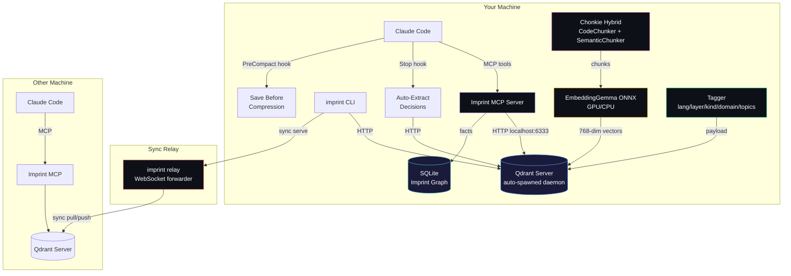
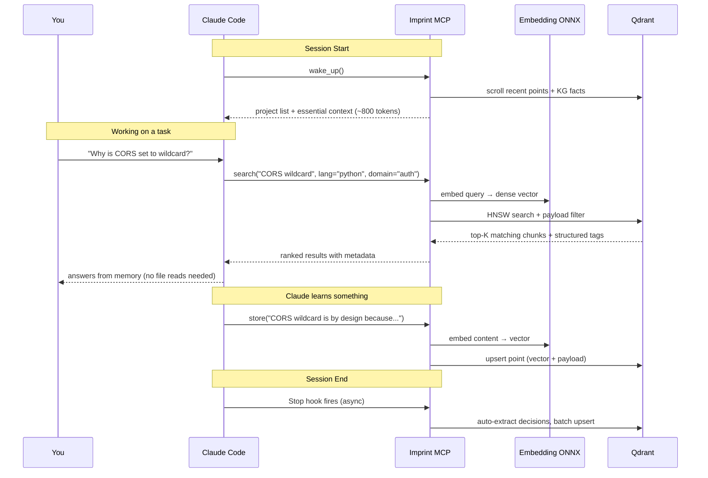
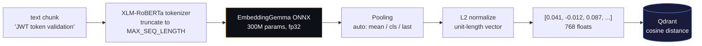
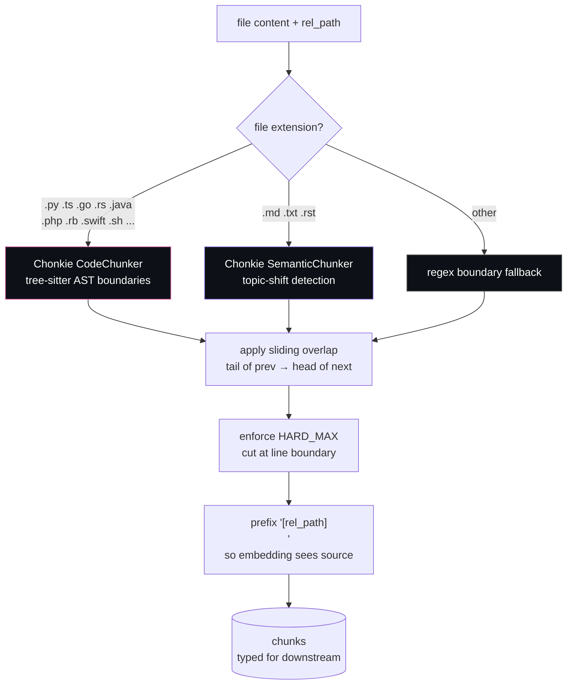
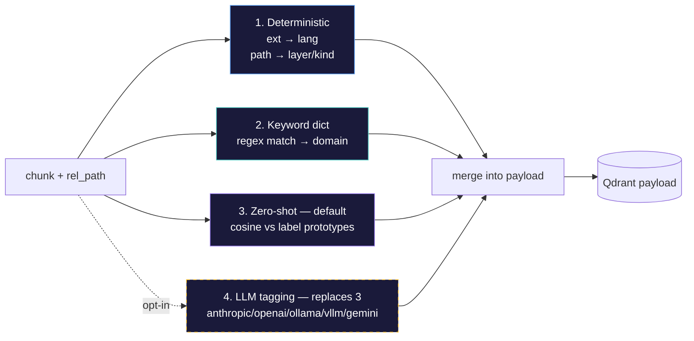
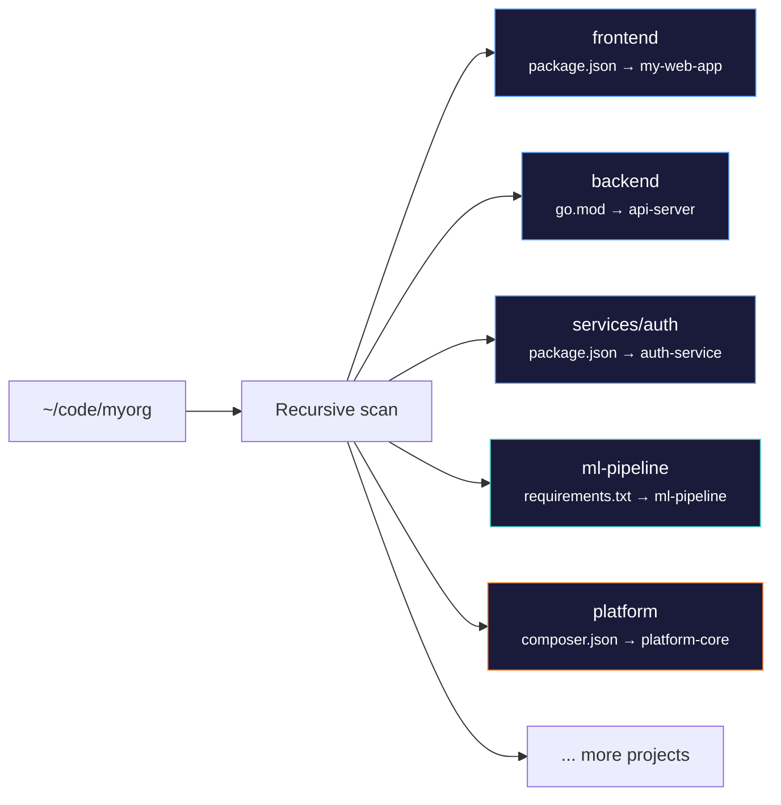
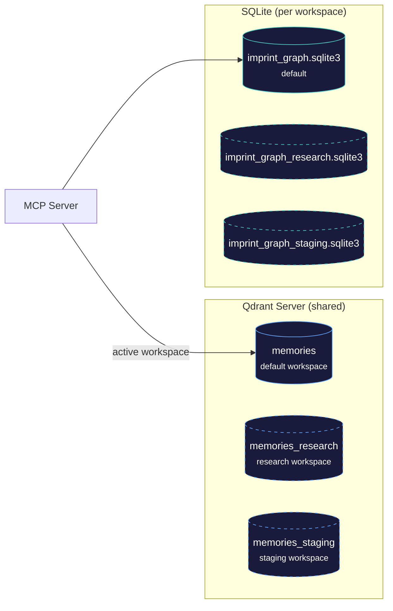
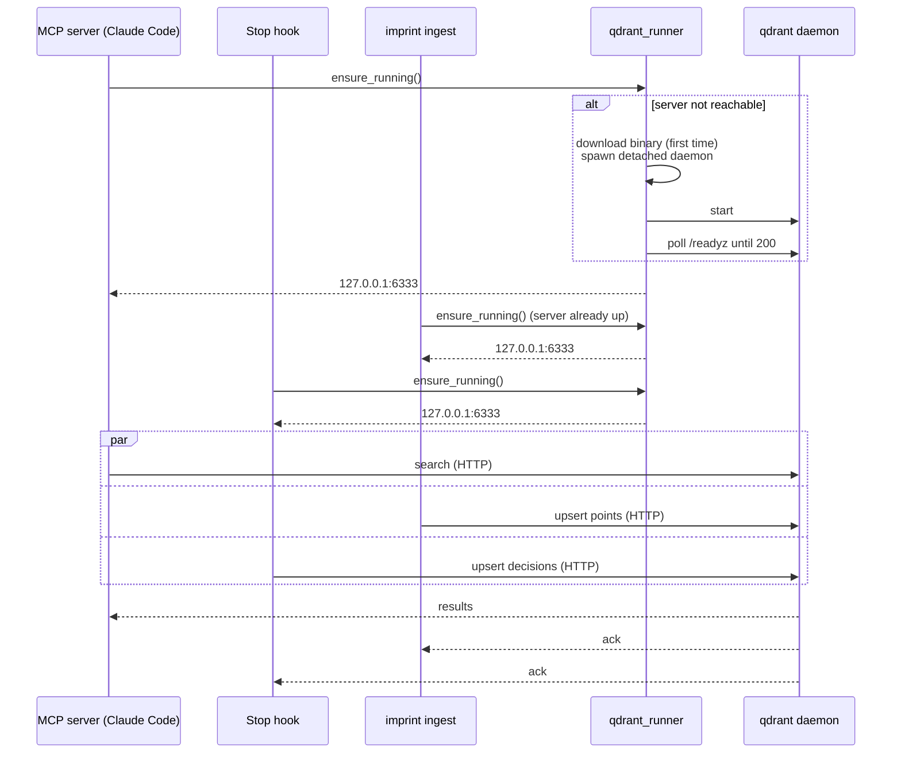
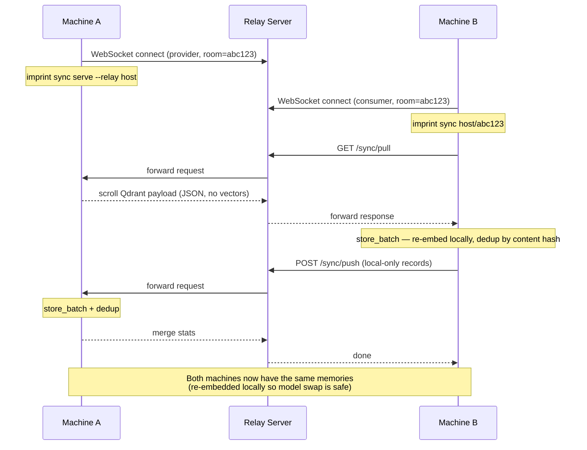
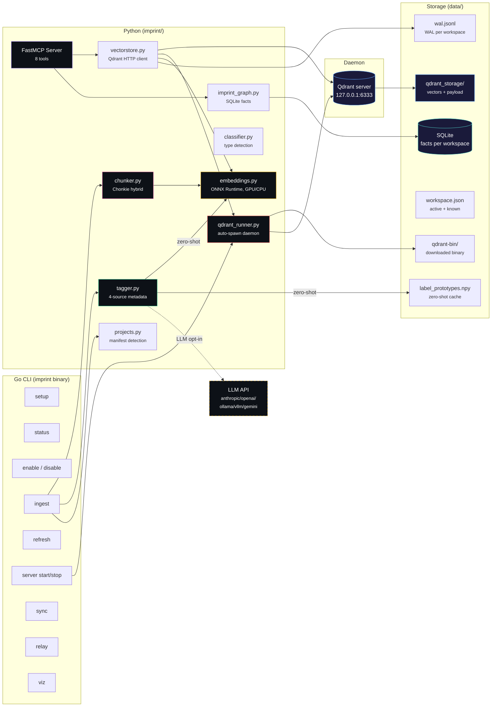

# Imprint Memory Layer

AI memory system for Claude Code. Gives Claude persistent memory across sessions — it remembers your projects, decisions, patterns, and conversations so you don't have to re-explain context every time.



## Install

**Linux / macOS:**
```bash
curl -fsSL https://raw.githubusercontent.com/alexandruleca/claude-code-memory-layer/main/install.sh | bash
```

**Windows (PowerShell):**
```powershell
irm https://raw.githubusercontent.com/alexandruleca/claude-code-memory-layer/main/install.ps1 | iex
```

This clones the repo, builds the binary, installs Python dependencies (including ONNX Runtime + Qdrant client + Chonkie), registers the MCP server, configures Claude Code hooks, and sets up shell aliases. One command, everything ready.

**GPU acceleration (optional):** install `onnxruntime-gpu` + CUDA 12 wheels (`pip install nvidia-cuda-runtime-cu12 nvidia-cublas-cu12 nvidia-cudnn-cu12 nvidia-cufft-cu12`) and the runtime auto-detects CUDA. See [GPU acceleration](#gpu-acceleration).

## Commands

```bash
imprint setup              # install deps, register MCP, configure Claude Code
imprint status             # is everything wired? show enabled/disabled, server pid, memory stats
imprint enable [target]    # re-wire MCP + hooks + start server (target: claude-code | cursor)
imprint disable            # stop server, unregister MCP, strip hooks (data preserved)
imprint ingest [dir]       # import memories + conversations [+ index projects]
imprint refresh <dir>      # re-index only changed files
imprint config             # show all settings with current values
imprint config set <k> <v> # persist a setting (e.g. model.name, qdrant.port)
imprint config get <key>   # show one setting with source + default
imprint config reset <key> # remove override, revert to default
imprint server <cmd>       # manage the local Qdrant daemon: start | stop | status | log
imprint workspace          # list workspaces and show active
imprint workspace switch <name>  # switch to workspace (creates if new)
imprint workspace delete <name>  # delete a workspace and its data
imprint wipe [--force]     # wipe active workspace
imprint wipe --all         # wipe everything (all workspaces)
imprint sync serve --relay <host>  # expose KB for peer syncing
imprint sync <host>/<id>   # bidirectional sync with a peer
imprint relay              # run the sync relay server
imprint viz                # 3D brain cluster visualization
imprint version            # print version
```

**`disable` / `enable` are kill switches.** Disable stops the Qdrant daemon, removes the MCP server registration from Claude Code, and strips the imprint hooks from `~/.claude/settings.json`. Your venv and data directory are kept intact, so re-enabling is instant — no re-ingest needed. `imprint status` shows the current state.

Example status output:

```
═══ Imprint Status ═══

[+] ENABLED

  ✓ MCP server registered (Claude Code)
  ✓ Hooks installed (5 entries)
  ✓ Qdrant server  http://127.0.0.1:6333  (pid 19803)
  ✓ Python venv    /home/you/code/imprint/.venv/bin/python
  ✓ Data dir       /home/you/code/imprint/data

  Memories: 14293  across 32 projects
    my-web-app (1551)
    backend-api (1053)
    ...
```

## How It Works

### Data Flow



### How Embeddings Work

The system converts every chunk of text — code, markdown, conversation, decision — into a dense vector (768-dim by default) that captures its meaning. Semantically similar text lands close together in vector space, which is what makes semantic search possible.



**Default model:** [Google EmbeddingGemma-300M](https://huggingface.co/google/embeddinggemma-300m) (Apache 2.0) — 300M params, 768-dim, 2048 token context, trained on 100+ languages from Gemma 3. We use the [ONNX Community export](https://huggingface.co/onnx-community/embeddinggemma-300m-ONNX). Supports fp32, q8, and q4 (no fp16).

**Alternative:** [BAAI BGE-M3](https://huggingface.co/BAAI/bge-m3) — 568M params, 1024-dim, 8192 token context. Switch via `imprint config set model.name Xenova/bge-m3 && imprint config set model.dim 1024`.

Swap to any HuggingFace ONNX model via `imprint config set model.name <repo>` — set `model.dim` and `model.seq_length` to match.

**Pooling** is configurable (`imprint config set model.pooling <strategy>`): `auto` (default — picks per model), `cls` (BGE-M3), `mean`, `last`. If the ONNX model returns pre-pooled 2D output, pooling is skipped automatically.

**Memory & speed safeguards** (set in [embeddings.py](imprint/embeddings.py)):

- ONNX `enable_cpu_mem_arena=False` + `enable_mem_pattern=False` — releases activations between calls instead of pinning a worst-case arena. Keeps RSS bounded on WSL2/low-RAM boxes.
- **Length-bucketed batching** in [`embed_documents_batch`](imprint/embeddings.py) — sorts chunks by length so each batch pads to the longest item in *its* bucket, not the global max. Critical because activation memory scales with `batch × seq_len`.
- **Per-batch `gc.collect()`** — drops intermediate tensors before the next iteration.
- **GPU VRAM cap** via `gpu_mem_limit` (default 2 GB) + `arena_extend_strategy=kSameAsRequested` — avoids the unbounded power-of-two arena growth that crashed WSL2 on long ingests.

### How Chunking Works

Long files don't embed well as a single vector — the model has limited context, and one giant vector blurs together too many concepts. The chunker splits text into focused, retrieval-friendly pieces.



**[Chonkie](https://github.com/chonkie-inc/chonkie) hybrid dispatch** in [chunker.py](imprint/chunker.py):

- **`CodeChunker`** — tree-sitter parses the file into an AST and splits at function/class/method boundaries. Language-aware (Python, TypeScript, Go, Rust, Java, PHP, Ruby, Swift, C/C++, etc.) so it never cuts mid-function.
- **`SemanticChunker`** — embeds sentences with a tiny [Model2Vec](https://github.com/MinishLab/model2vec) static embedder, computes cosine similarity over a sliding window, and splits where similarity drops below `threshold=0.7`. Dynamic chunk size: a coherent topic stays together; a topic shift triggers a split.
- **Sliding overlap** — `IMPRINT_CHUNK_OVERLAP=400` chars from the tail of each chunk prepended to the next. Preserves boundary context so retrieval doesn't miss signal sitting right at a split.
- **Semantic subsplit for code** — oversized code chunks (>8000 chars) get secondary topic-shift splitting via SemanticChunker. Small focused functions stay whole; large functions split where the logic changes.

| Knob | Default | Effect |
|---|---|---|
| `IMPRINT_CHUNK_SIZE_CODE` | 4000 chars | Soft target for code (semantic subsplit above 2×) |
| `IMPRINT_CHUNK_SIZE_PROSE` | 6000 chars | Soft target for prose (topic-shift is primary boundary) |
| `IMPRINT_CHUNK_HARD_MAX` | 8000 chars | Absolute cap (~2k tokens, fits within 2048 token context) |
| `IMPRINT_CHUNK_OVERLAP` | 400 chars | Sliding window between chunks |

### Metadata Tags (search & filter)

Every chunk gets a structured tag payload stored in Qdrant:

```python
{
    "lang":   "python",                 # from file extension
    "layer":  "api",                    # from path (api/ui/tests/infra/...)
    "kind":   "source",                 # source/test/migration/readme/types/...
    "domain": ["auth", "db"],           # keyword-matched topics
    "topics": ["jwt-validation", ...]   # zero-shot (default) or LLM-derived
}
```



Four tag sources, layered from cheap to rich:

| # | Source | What it produces | Cost | Default |
|---|--------|-----------------|------|---------|
| 1 | **Deterministic** | `lang` (from extension), `layer` (from path), `kind` (from filename) | Free | Always on |
| 2 | **Keyword dict** | `domain[]` — 13 categories via regex: auth, db, api, math, rendering, ui, testing, infra, ml, perf, security, build, payments | Free | Always on |
| 3 | **Zero-shot** | `topics[]` — cosine similarity against pre-embedded label prototypes (threshold > 0.35) | 1 vector compare per chunk per label | **On by default** (opt-out: `IMPRINT_ZERO_SHOT_TAGS=0`) |
| 4 | **LLM tagging** | `topics[]` — 1–4 tags per chunk from an LLM | 1 API call per chunk | Opt-in (`IMPRINT_LLM_TAGS=1`), **replaces** zero-shot |

When LLM tagging is enabled it replaces zero-shot — no point running both. See [tagger.py](imprint/tagger.py) for implementation.

#### LLM Tagger Providers

Set `IMPRINT_LLM_TAGS=1` and pick a provider:

| Provider | `IMPRINT_LLM_TAGGER_PROVIDER` | Default model | API key env var | Notes |
|---|---|---|---|---|
| Anthropic | `anthropic` (default) | `claude-haiku-4-5` | `ANTHROPIC_API_KEY` | Uses native Anthropic SDK |
| OpenAI | `openai` | `gpt-4o-mini` | `OPENAI_API_KEY` | OpenAI SDK |
| Gemini | `gemini` | `gemini-2.0-flash` | `GOOGLE_API_KEY` | Via OpenAI-compatible endpoint |
| Ollama | `ollama` | `llama3.2` | — | Local, no API key needed |
| vLLM | `vllm` | `default` | — | Local, no API key needed |

**Overrides:**

| Env var | Purpose | Example |
|---|---|---|
| `IMPRINT_LLM_TAGGER_MODEL` | Use a different model | `IMPRINT_LLM_TAGGER_MODEL=llama3.1:70b` |
| `IMPRINT_LLM_TAGGER_BASE_URL` | Custom API endpoint | `IMPRINT_LLM_TAGGER_BASE_URL=http://gpu-box:8000/v1` |
| `IMPRINT_LLM_TAGGER_API_KEY` | Fallback API key (for providers without a standard env var) | — |

Ollama and vLLM use OpenAI-compatible APIs internally. Point `IMPRINT_LLM_TAGGER_BASE_URL` at any OpenAI-compatible server to use unlisted providers.

**MCP search supports payload filters** — the model can narrow:

```python
mcp__imprint__search(
    query="JWT validation",
    lang="python",                  # tags.lang
    layer="api",                    # tags.layer
    domain="auth,security",         # any-match against tags.domain
    project="my-web-app",
    type="pattern",
    limit=10,
)
```

### Project Detection

When you run `imprint ingest ~/code`, it recursively finds real project roots by looking for manifest files — not just top-level directories:



| Manifest | Type | Name extracted from |
|---|---|---|
| `package.json` | Node.js | `name` field |
| `go.mod` | Go | `module` path |
| `pyproject.toml` / `setup.py` | Python | `name` field or dir name |
| `requirements.txt` | Python | directory name |
| `composer.json` | PHP | `name` field |
| `Cargo.toml` | Rust | `name` field |
| `pom.xml` / `build.gradle` | Java | directory name |
| `Gemfile` | Ruby | directory name |

Projects are identified by **canonical name** from the manifest, not the file path. The same project at different paths on different machines gets the same identity — this makes sync work across machines.

### Workspaces

Workspaces provide isolated memory environments. Each workspace gets its own Qdrant collection, SQLite knowledge graph, and write-ahead log — complete data isolation on the same Qdrant server.



**Default workspace** (`default`) uses the same file and collection names as before — zero migration. Existing data is automatically in the default workspace.

```bash
# List workspaces
imprint workspace
#   default (active)

# Create and switch to a new workspace
imprint workspace switch research
#   [+] created and switched to workspace: research

# Ingest into the active workspace — data goes to `memories_research` collection
imprint ingest ~/code/research-project

# Switch back
imprint workspace switch default

# Delete a workspace (must not be active)
imprint workspace delete research
```

**Naming rules:** lowercase alphanumeric + hyphens, max 40 characters, must start with letter or digit.

**Data per workspace:**

| Workspace | Collection | SQLite | WAL |
|---|---|---|---|
| `default` | `memories` | `imprint_graph.sqlite3` | `wal.jsonl` |
| `research` | `memories_research` | `imprint_graph_research.sqlite3` | `wal_research.jsonl` |

**Wipe behavior:**

```bash
imprint wipe                       # wipe active workspace only (via API — no server restart)
imprint wipe --workspace research  # wipe a specific workspace
imprint wipe --all                 # stop Qdrant, delete all data, restart fresh
```

The MCP server detects workspace changes dynamically — if you run `imprint workspace switch` in a terminal, the next MCP tool call picks up the new workspace automatically. Config is stored in `data/workspace.json`.

### MCP Tools

Claude Code gets 8 tools via the imprint MCP server:

| Tool | Purpose |
|------|---------|
| `wake_up` | Load prior context at session start (~800 tokens) |
| `search` | Semantic search with `project`/`type`/`lang`/`layer`/`kind`/`domain` filters |
| `store` | Save a memory — auto-classified as decision/pattern/bug/etc. |
| `delete` | Remove a memory by ID |
| `kg_add` | Add a temporal fact (subject → predicate → object) |
| `kg_query` | Query facts with optional time filtering |
| `kg_invalidate` | Mark a fact as no longer valid |
| `status` | Show memory count by project |

### Automatic Updates

The imprint memory stays current through three mechanisms:

- **Stop hook** (async) — after each Claude response, parses the conversation transcript, extracts Q+A exchanges and decision-like statements, stores them automatically with `lang=conversation` tags
- **PreCompact hook** (sync) — before Claude's context window gets compressed, blocks and instructs Claude to save all important context via MCP tools
- **`imprint refresh`** — compares file modification times via `vs.get_source_mtimes()`, only re-chunks + re-embeds what changed

### Concurrency: Auto-Spawned Local Server

Embedded Qdrant (the `path=...` mode) is single-writer — only one process can hold the on-disk lock. That breaks the moment your MCP server, your hooks, and a `imprint ingest` all try to write at once. Imprint sidesteps the limitation by **auto-spawning a local Qdrant server** on `127.0.0.1:6333`.



[`qdrant_runner.py`](imprint/qdrant_runner.py) handles the lifecycle:

- **First call**: downloads the pinned Qdrant binary (~50 MB) from GitHub releases into `data/qdrant-bin/`, then `subprocess.Popen([..., start_new_session=True])` so the daemon survives the parent process. Logs to `data/qdrant.log`, PID written to `data/qdrant.pid`.
- **Subsequent calls**: cheap HTTP probe to `/readyz` — returns immediately if alive.
- **Storage**: `data/qdrant_storage/` (collection data) + `data/qdrant_snapshots/`. Both gitignored.
- **Shutdown**: `imprint server stop` (or `imprint disable`) sends SIGTERM via the PID file.

| Env var | Default | Purpose |
|---|---|---|
| `IMPRINT_QDRANT_HOST` | `127.0.0.1` | Bind / connect host |
| `IMPRINT_QDRANT_PORT` | `6333` | HTTP port |
| `IMPRINT_QDRANT_GRPC_PORT` | `6334` | gRPC port |
| `IMPRINT_QDRANT_VERSION` | `v1.17.1` | Pinned release tag |
| `IMPRINT_QDRANT_BIN` | (auto) | Override binary path (e.g. system-installed qdrant) |
| `IMPRINT_QDRANT_NO_SPAWN` | `0` | Set `1` to disable auto-spawn — connect to your own managed server |

**Why server mode and not embedded?** Embedded mode pins a filesystem lock and rejects any second client — this conflicts with Claude Code (always-on MCP) running alongside `imprint ingest`, hooks writing decisions, and tools like `imprint viz` reading the collection. Server mode supports unlimited concurrent connections at the cost of a single ~50 MB binary in your data dir and a ~50 MB resident process. Worth it.

**Bring your own server**: set `IMPRINT_QDRANT_NO_SPAWN=1` and point `IMPRINT_QDRANT_HOST` at a Docker (`docker run -p 6333:6333 qdrant/qdrant`) or remote Qdrant. Auto-spawn is disabled and the runner connects directly.

### Lifecycle commands

```bash
imprint status            # is the system enabled? server pid? memory count?
imprint enable            # idempotent re-wire of MCP + hooks + server
imprint disable           # stops daemon, removes MCP registration, strips hooks
imprint server start      # explicit server boot (auto on first MCP/CLI call)
imprint server stop       # SIGTERM the daemon
imprint server status     # JSON: pid, host, port, log path
imprint server log        # path to qdrant.log for tailing
```

### Peer Sync



The relay server is a stateless WebSocket forwarder — deploy it on any server or your Docker Swarm cluster behind Traefik. Room IDs expire after 1 hour. Vectors are **not** transferred over the wire — peers re-embed content locally, which means machines using different models or devices can sync without vector-format compatibility headaches.

```bash
# Self-host the relay
imprint relay --port 8430

# Machine A
imprint sync serve --relay sync.yourdomain.com
# → prints: imprint sync sync.yourdomain.com/abc123

# Machine B
imprint sync sync.yourdomain.com/abc123
# → bidirectional merge, done
```

### Visualization

```bash
imprint viz
```

Opens an Obsidian-style force-directed graph in a Chrome app window:
- Sigma.js WebGL renderer — handles 100k+ nodes at interactive framerates
- ForceAtlas2 layout clusters same-project nodes together organically
- Hover highlights node + direct neighbors (Obsidian-style dim/bright)
- Click opens rich detail panel: tags, metadata, related nodes with similarity %, content preview
- Search highlights matching nodes, filter by project via legend
- Real-time updates via SSE when the imprint memory changes
- Pan, zoom, drag nodes to rearrange

## GPU Acceleration

Embedding throughput on CPU is sufficient for incremental refresh but slow for initial large ingests. GPU is ~20× faster.

```bash
# Force GPU
IMPRINT_DEVICE=gpu imprint ingest ~/code

# Force CPU (e.g. on a headless box without CUDA)
IMPRINT_DEVICE=cpu imprint ingest ~/code

# Auto-detect (default) — uses GPU if onnxruntime-gpu + CUDAExecutionProvider available
imprint ingest ~/code
```

**Setup checklist (one-time):**

```bash
.venv/bin/pip install onnxruntime-gpu \
    nvidia-cuda-runtime-cu12 nvidia-cublas-cu12 nvidia-cudnn-cu12 \
    nvidia-cufft-cu12 nvidia-curand-cu12
```

The runtime [`_preload_cuda_libs()`](imprint/embeddings.py) dlopens the pip-installed CUDA libraries before constructing the ORT session, so you don't need `LD_LIBRARY_PATH` set at process start.

**Tunables** (also configurable via `imprint config set model.*`):

| Setting key | Default | Notes |
|---|---|---|
| `model.device` | `auto` | `auto` / `cpu` / `gpu` |
| `model.gpu_mem_mb` | `2048` | VRAM cap for ORT CUDA arena (WSL2-safe; raise on dedicated GPUs) |
| `model.gpu_device` | `0` | CUDA device index |
| `model.threads` | `4` | CPU intra-op threads |
| `model.seq_length` | `2048` | Token truncation cap |
| `model.name` | `onnx-community/embeddinggemma-300m-ONNX` | HF repo (any HuggingFace ONNX model) |
| `model.dim` | `768` | Embedding dimension (must match model) |
| `model.file` | auto | Override variant pick |
| `model.pooling` | auto | Pooling: auto / cls / mean / last |

## Configuration

All settings can be persisted via `imprint config` instead of setting environment variables. Settings are stored in `data/config.json` (gitignored).

**Precedence:** env var > config.json > hardcoded default. Environment variables always win, so you can override config.json for one-off runs.

```bash
# Switch to a different embedding model
imprint config set model.name nomic-ai/nomic-embed-text-v2-moe
imprint config set model.dim 768
imprint config set model.seq_length 512

# Use local Ollama for LLM tagging
imprint config set tagger.llm true
imprint config set tagger.llm_provider ollama
imprint config set tagger.llm_model llama3.2

# Custom Qdrant server
imprint config set qdrant.host 192.168.1.50
imprint config set qdrant.no_spawn true

# See what's changed
imprint config

# One-off env override (doesn't persist)
IMPRINT_DEVICE=gpu imprint ingest ~/code

# Reset everything
imprint config reset --all
```

### All Settings

| Key | Default | Description |
|-----|---------|-------------|
| **Embedding model** | | |
| `model.name` | `onnx-community/embeddinggemma-300m-ONNX` | HuggingFace embedding model repo |
| `model.file` | `auto` | ONNX model file (auto = pick by device) |
| `model.device` | `auto` | Compute device: auto / cpu / gpu |
| `model.dim` | `768` | Embedding vector dimension |
| `model.seq_length` | `2048` | Token cap per embed call |
| `model.threads` | `4` | CPU intra-op threads for ONNX |
| `model.gpu_mem_mb` | `2048` | VRAM cap for ORT CUDA arena (MB) |
| `model.gpu_device` | `0` | CUDA device ID |
| `model.pooling` | `auto` | Pooling strategy: auto / cls / mean / last |
| **Qdrant** | | |
| `qdrant.host` | `127.0.0.1` | Qdrant bind/connect host |
| `qdrant.port` | `6333` | Qdrant HTTP port |
| `qdrant.grpc_port` | `6334` | Qdrant gRPC port |
| `qdrant.version` | `v1.17.1` | Pinned Qdrant release for auto-download |
| `qdrant.no_spawn` | `false` | Skip auto-spawn (BYO server) |
| **Chunker** | | |
| `chunker.overlap` | `400` | Sliding overlap chars between chunks |
| `chunker.size_code` | `4000` | Soft target chunk size for code |
| `chunker.size_prose` | `6000` | Soft target chunk size for prose |
| `chunker.hard_max` | `8000` | Absolute max chunk size |
| `chunker.semantic_threshold` | `0.5` | Topic-shift threshold (lower = sharper splits) |
| **Tagger** | | |
| `tagger.zero_shot` | `true` | Enable zero-shot topic tagging |
| `tagger.llm` | `false` | Enable LLM topic tagging (replaces zero-shot) |
| `tagger.llm_provider` | `anthropic` | LLM provider: anthropic / openai / ollama / vllm / gemini |
| `tagger.llm_model` | `claude-haiku-4-5` | LLM tagger model name |
| `tagger.llm_base_url` | — | LLM tagger API base URL override |
| **Other** | | |
| `collection` | `memories` | Default Qdrant collection name |

Each setting also has an `IMPRINT_*` env var (shown via `imprint config get <key>`). Env vars still work and take priority over config.json.

## Architecture



| Component | Technology | Purpose |
|---|---|---|
| Vector store | Qdrant server (auto-spawned daemon) | HNSW + int8 scalar quantization, payload-indexed filters, multi-client safe |
| Server runner | `qdrant_runner.py` | Downloads + spawns + supervises the local Qdrant daemon |
| Embeddings | EmbeddingGemma-300M via ONNX Runtime | 768-dim, 2048 ctx. Configurable model via `imprint config` |
| Chunking | Chonkie 1.6+ | `CodeChunker` (tree-sitter) + `SemanticChunker` (topic shifts) + sliding overlap |
| Metadata tagger | Python | Deterministic + keyword dict + zero-shot (default) + opt-in multi-provider LLM |
| Imprint graph | SQLite | Temporal facts with valid_from/ended |
| MCP server | FastMCP (Python) | 8 tools — connects to Qdrant via HTTP |
| CLI | Go | `setup`, `status`, `enable`, `disable`, `ingest`, `refresh`, `server`, `workspace`, `wipe`, `sync`, `relay`, `viz` |
| Relay | Go (nhooyr/websocket) | Stateless WebSocket forwarder for P2P sync |

## Building from Source

```bash
make build        # current platform
make all          # cross-compile (linux, macOS, Windows)
```

## Docker (Relay Server)

```bash
docker build -t imprint-relay .
docker run -p 8430:8430 imprint-relay
```

Or deploy to Docker Swarm with `docker-compose.relay.yml`.

## Requirements

**Core:**
- Python 3.9+
- pip
- [Claude Code CLI](https://docs.anthropic.com/en/docs/claude-code/overview)

**Optional — GPU acceleration:**
- NVIDIA GPU + CUDA 12 + `onnxruntime-gpu` for ~20× faster embedding (see [GPU acceleration](#gpu-acceleration))

**LLM topic tagging** (`IMPRINT_LLM_TAGS=1`) — `anthropic` and `openai` SDKs are installed automatically with `imprint setup`. No extra steps needed for any provider.

## Roadmap Features

- [ ] Local Auto Back-up
- [ ] External Qdrant Instance instead of local db
- [ ] BackUp/Sync to another Qdrant Remote Instance Server
- [ ] Document (pdf, doc, odt, ...etc) ingestion capability
- [ ] Video / Audio ingestion capability
- [ ] URL ingestion capability