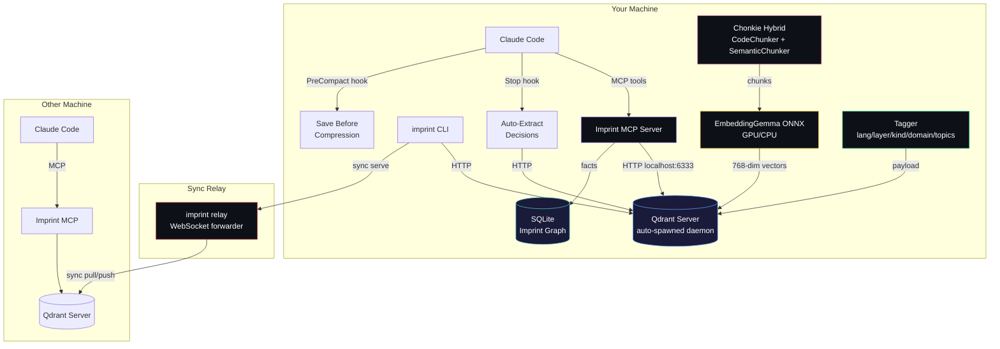

# Imprint Memory Layer

[](https://github.com/alexandruleca/imprint-memory-layer/actions/workflows/ci.yml)
[](https://github.com/alexandruleca/imprint-memory-layer/actions/workflows/release.yml)
[](https://github.com/alexandruleca/imprint-memory-layer/actions/workflows/dev-release.yml)
[](https://github.com/alexandruleca/imprint-memory-layer/releases/latest)
[](LICENSE)

AI memory system MCP. Gives Claude Code, Cursor, Codex CLI, GitHub Copilot, and Cline persistent memory across sessions — it remembers your projects, decisions, patterns, and conversations so you don't have to re-explain context every time. One command wires the MCP server into whichever host tool you use.

**Runs 100% locally. Zero API credits consumed by default.** Everything from embeddings, chunking, tagging, vector search, and the knowledge graph — runs on your machine:

- **Embeddings**: EmbeddingGemma-300M via ONNX Runtime (GPU or CPU), no network calls, no per-token cost.
- **Vector store**: Qdrant auto-spawned as a local daemon on `127.0.0.1:6333`. Your data never leaves the box unless you sync it to another device.
- **Chunking**: Chonkie hybrid (tree-sitter CodeChunker + SemanticChunker), pure Python, local.
- **Tagging**: deterministic rules + zero-shot cosine similarity against pre-embedded labels. No LLM call per chunk.
- **Imprint graph**: SQLite on disk for temporal facts.

The ingestion flow: scan dir → detect project → chunk files → embed chunks → tag (lang/layer/kind/domain/topics) → upsert into Qdrant. A Stop hook auto-extracts decisions from Claude transcripts; a PreCompact hook saves context before window compression. Search goes straight to the local vector DB — no round-trip to any provider.

**Optional cloud LLM tagging** is opt-in only (`imprint config set tagger.llm true`) if you want more granular topics and are fine spending credits. Providers: Anthropic, OpenAI, Gemini, or fully-local Ollama / vLLM. Leave it off and nothing ever talks to a paid API.



## Quick Install

**Linux / macOS:**
```bash
curl -fsSL https://raw.githubusercontent.com/alexandruleca/imprint-memory-layer/main/install.sh | bash
```

**Windows (PowerShell):**
```powershell
irm https://raw.githubusercontent.com/alexandruleca/imprint-memory-layer/main/install.ps1 | iex
```

Pin a specific version, pick the dev channel, or use prebuilt Docker images — see [docs/installation.md](docs/installation.md).

## Supported hosts

`imprint setup <target>` auto-wires the MCP server into each supported AI coding tool. Run `imprint setup all` to configure every host that's installed on your machine; missing tools are skipped with a warning, not an error.

| Target        | Wired into                                         | Config file                                                                           | Enforcement         |
|---------------|-----------------------------------------------------|----------------------------------------------------------------------------------------|---------------------|
| `claude-code` | Claude Code CLI (MCP + hooks + global `CLAUDE.md`) | `~/.claude/settings.json` + MCP registered via `claude mcp add`                        | Hard (PreToolUse)   |
| `cursor`      | Cursor IDE (MCP + always-on rule)                  | `~/.cursor/mcp.json` + `~/.cursor/rules/imprint.mdc`                                   | Text-only (rule)    |
| `codex`       | OpenAI Codex CLI                                   | `~/.codex/config.toml` (`[mcp_servers.imprint]`)                                       | Text-only           |
| `copilot`     | GitHub Copilot (VSCode agent mode), user-global    | `<VSCode user>/mcp.json` (`servers.imprint`)                                           | Text-only           |
| `cline`       | Cline — VSCode extension + standalone CLI          | `<VSCode user>/globalStorage/saoudrizwan.claude-dev/settings/cline_mcp_settings.json` and/or `~/.cline/data/settings/cline_mcp_settings.json` | Text-only |

`imprint disable` is symmetric — it tears down the MCP entry from every config file above that still exists (the venv and data are always preserved so re-enabling is fast).

## Commands

```bash
imprint setup [target]     # install deps, register MCP, configure the chosen host tool
                           #   target: claude-code (default) | cursor | codex | copilot | cline | all
imprint status             # is everything wired? show enabled/disabled, server pid, memory stats
imprint enable [target]    # re-wire MCP + hooks + start server
                           #   target: claude-code | cursor | codex | copilot | cline | all
imprint disable            # stop server, unregister MCP from every host, strip Claude hooks (data preserved)
imprint ingest [dir]       # import memories + conversations [+ index projects]
imprint refresh <dir>      # re-index only changed files
imprint config             # show all settings with current values
imprint config set <k> <v> # persist a setting (e.g. model.name, qdrant.port)
imprint config get <key>   # show one setting with source + default
imprint config reset <key> # remove override, revert to default
imprint server <cmd>       # manage the local Qdrant daemon: start | stop | status | log
imprint workspace          # list workspaces and show active
imprint workspace switch <name>  # switch to workspace (creates if new)
imprint workspace delete <name>  # delete a workspace and its data
imprint wipe [--force]     # wipe active workspace
imprint wipe --all         # wipe everything (all workspaces)
imprint sync serve [--relay <host>]      # expose KB for peer syncing (default: imprint.alexandruleca.com)
imprint sync <id> --pin <pin>            # sync via default relay (or <host>/<id> / wss://<host>/<id>)
imprint relay              # run the sync relay server
imprint version            # print version
```

## Documentation

| Topic | File |
|---|---|
| Install, versioning, channels, Docker | [docs/installation.md](docs/installation.md) |
| Components, data flow, Qdrant daemon, lifecycle | [docs/architecture.md](docs/architecture.md) |
| Embedding pipeline + GPU acceleration | [docs/embeddings.md](docs/embeddings.md) |
| Chunking strategy + tunables | [docs/chunking.md](docs/chunking.md) |
| Metadata tags, LLM providers, search filters | [docs/tagging.md](docs/tagging.md) |
| Workspaces + project detection | [docs/workspaces.md](docs/workspaces.md) |
| MCP tools + automatic updates | [docs/mcp.md](docs/mcp.md) |
| Peer sync, relay server, dashboard | [docs/sync.md](docs/sync.md) |
| All settings (`imprint config`) | [docs/configuration.md](docs/configuration.md) |
| Building from source + CI/release flow | [docs/building.md](docs/building.md) |
| Benchmarks & token savings | [BENCHMARK.md](BENCHMARK.md) |

## Glossary

Terms used across the docs.

| Term | Definition |
|---|---|
| **Chunk** | A sub-file unit of text (a function, class, markdown section, conversation turn) that gets its own embedding vector. Produced by the chunker. |
| **Embedding** | Dense numeric vector (default 768-dim) representing the semantic meaning of a chunk. Similar meanings → nearby vectors. |
| **Qdrant** | The vector database that stores embeddings + payloads. Runs as an auto-spawned local daemon on `127.0.0.1:6333`. |
| **Collection** | Qdrant's term for a named set of vectors. Each workspace has its own collection (e.g. `memories`, `memories_research`). |
| **Workspace** | Isolated memory environment — dedicated Qdrant collection + SQLite DB + WAL. Lets you separate research/staging/prod memories. |
| **Imprint Graph** | Temporal fact store (SQLite) for structured `subject → predicate → object` facts with `valid_from` / `ended` timestamps. |
| **MCP** | Model Context Protocol — the open protocol Claude Code uses to call external tools. Imprint ships an MCP server with 8 tools. |
| **Project** | A codebase identified by a canonical name from its manifest (`package.json`, `go.mod`, etc.). Projects get the same identity across machines even if paths differ. |
| **Layer** | Path-derived tag: `api`, `ui`, `tests`, `infra`, `config`, `migrations`, `docs`, `scripts`, `cli`. |
| **Kind** | Filename-derived tag: `source`, `test`, `migration`, `readme`, `types`, `module`, `qa`, `auto-extract`. |
| **Domain** | Content-derived tag from keyword regex: `auth`, `db`, `api`, `math`, `rendering`, `ui`, `testing`, `infra`, `ml`, `perf`, `security`, `build`, `payments`. |
| **Topics** | Free-form tags from zero-shot cosine similarity or (opt-in) LLM classification — more granular than `domain`. |
| **Ingestion** | Scanning a directory, detecting projects, chunking files, embedding chunks, tagging, and upserting into Qdrant. |
| **Refresh** | Incremental re-ingest — only re-chunks + re-embeds files whose mtime changed since last run. |
| **Auto-extract** | Stop hook that parses conversation transcripts after each Claude response and stores Q+A exchanges + decision-like statements. |
| **PreCompact hook** | Synchronous hook that fires before Claude's context window compresses — instructs Claude to save important context via MCP tools first. |
| **Relay server** | Stateless WebSocket forwarder (`imprint relay`) that brokers peer sync between two machines. No vectors cross the wire — only raw content, re-embedded locally on the receiver. |
| **WAL** | Write-ahead log — append-only `wal.jsonl` per workspace, used for replay / recovery of memory operations. |
| **Zero-shot tagging** | Classifying chunks by cosine similarity against pre-embedded label prototypes — no per-chunk LLM call. |
| **Dev / stable channel** | Two release tracks. Dev = prerelease on every `dev` push (`vX.Y.Z-dev.N`). Stable = conventional-commit release on `main` merges (`vX.Y.Z`). |

## Benchmarks

Imprint reduces Claude Code's token consumption by serving focused semantic search results instead of requiring full file reads. See [BENCHMARK.md](BENCHMARK.md) for methodology and detailed results.

| Category | Avg Token Savings | Avg Cost Savings |
|----------|------------------|------------------|
| Information prompts | _pending_ | _pending_ |
| Creation tasks | _pending_ | _pending_ |

> Reproduce: `bash benchmark/run.sh` — see [BENCHMARK.md](BENCHMARK.md) for details.

## Roadmap

- [ ] Local Auto Back-up
- [ ] External Qdrant Instance instead of local db
- [ ] BackUp/Sync to another Qdrant Remote Instance Server
- [x] Document (pdf, doc, odt, ...etc) ingestion capability
- [ ] Video / Audio ingestion capability
- [x] URL ingestion capability

## License

Imprint is licensed under the [Apache License 2.0](LICENSE).

Third-party dependencies retain their own licenses — see [THIRD_PARTY_LICENSES.md](THIRD_PARTY_LICENSES.md) for the full table.

**Default embedding model** ([EmbeddingGemma-300M](https://huggingface.co/google/embeddinggemma-300m)) is governed by the [Gemma Terms of Use](https://ai.google.dev/gemma/terms) and [Prohibited Use Policy](https://ai.google.dev/gemma/prohibited_use_policy) — *not* Apache 2.0. Imprint does not bundle weights; they're downloaded at runtime from HuggingFace, where you accept Gemma's terms. Switch to a differently-licensed model (e.g. [BGE-M3](https://huggingface.co/BAAI/bge-m3), MIT) via `imprint config set model.name <repo>`.

## Contact

Questions, feedback, or bug reports? Reach out:

[](https://x.com/AlexandruLeca)
[](https://github.com/alexandruleca/imprint-memory-layer/issues)
