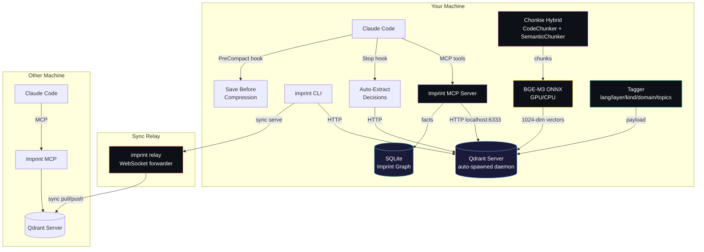
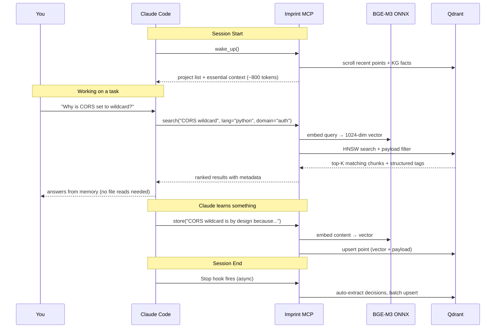
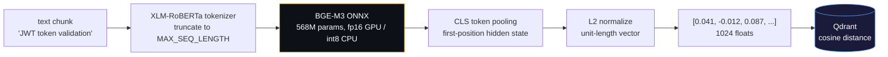
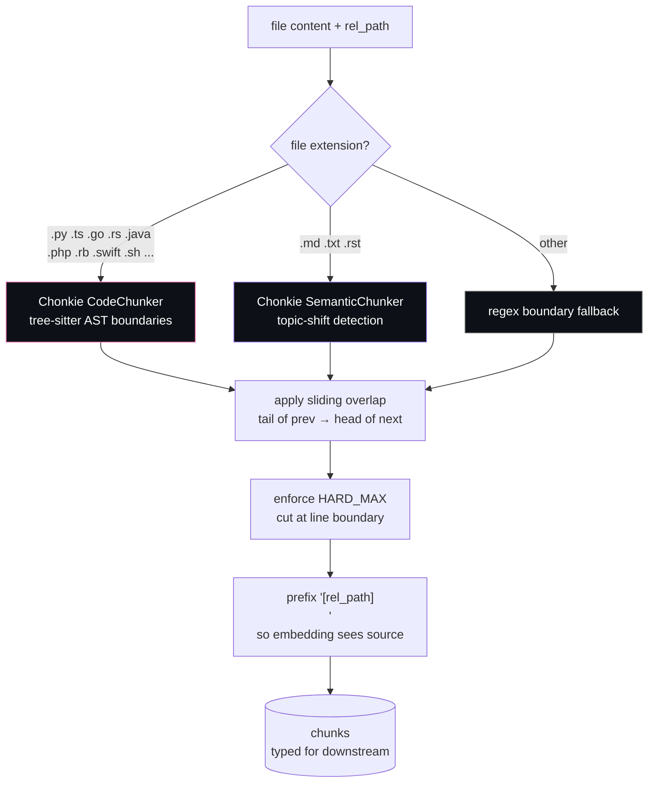
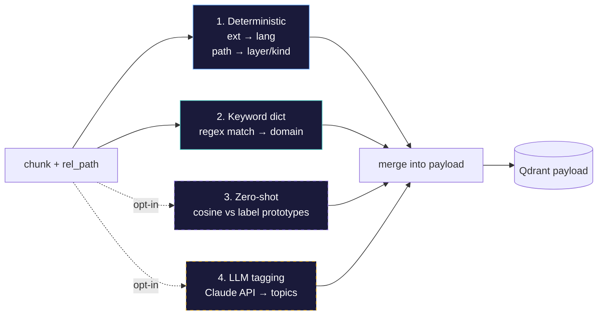
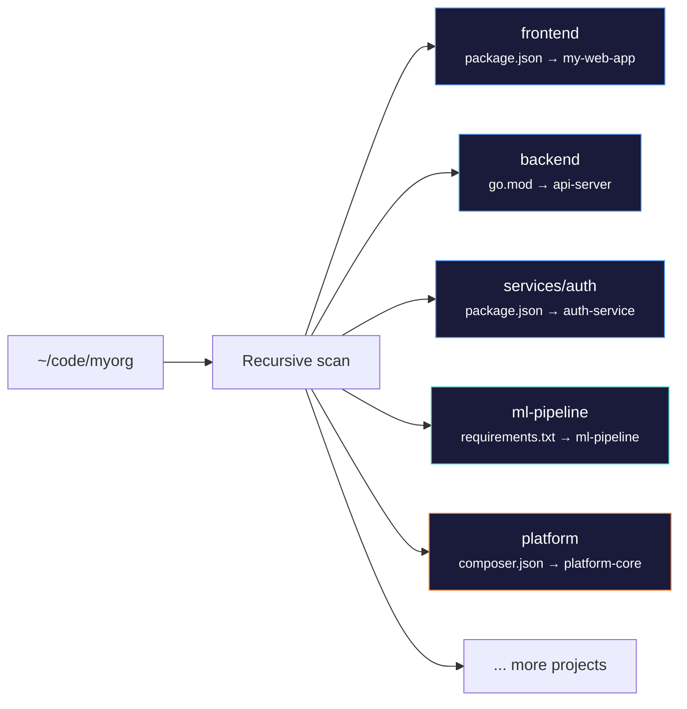
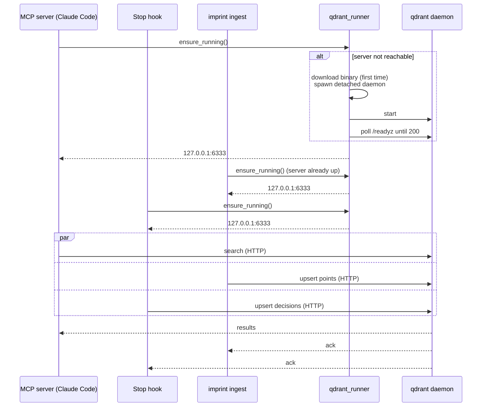
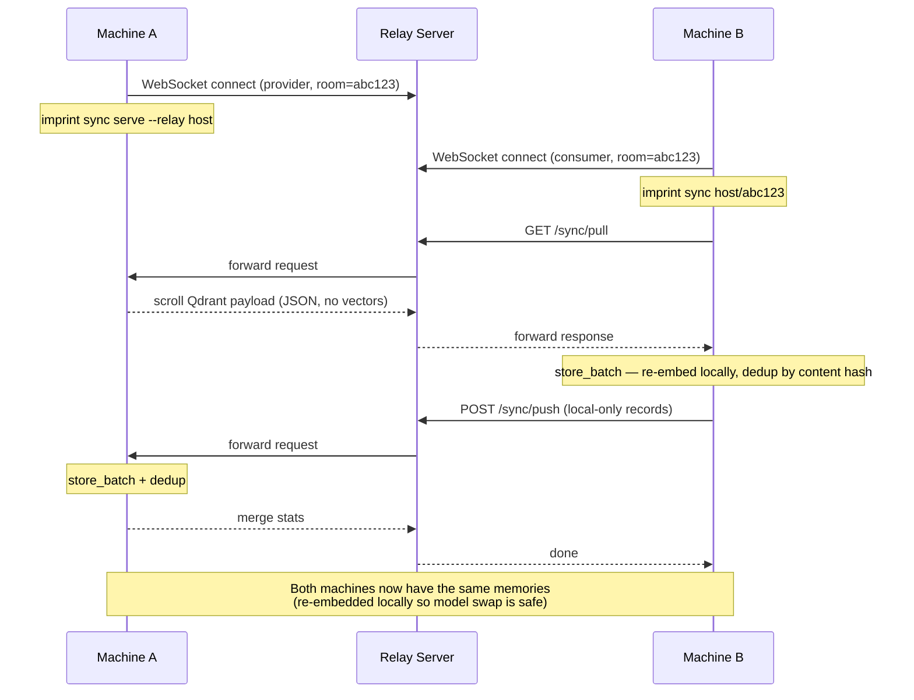
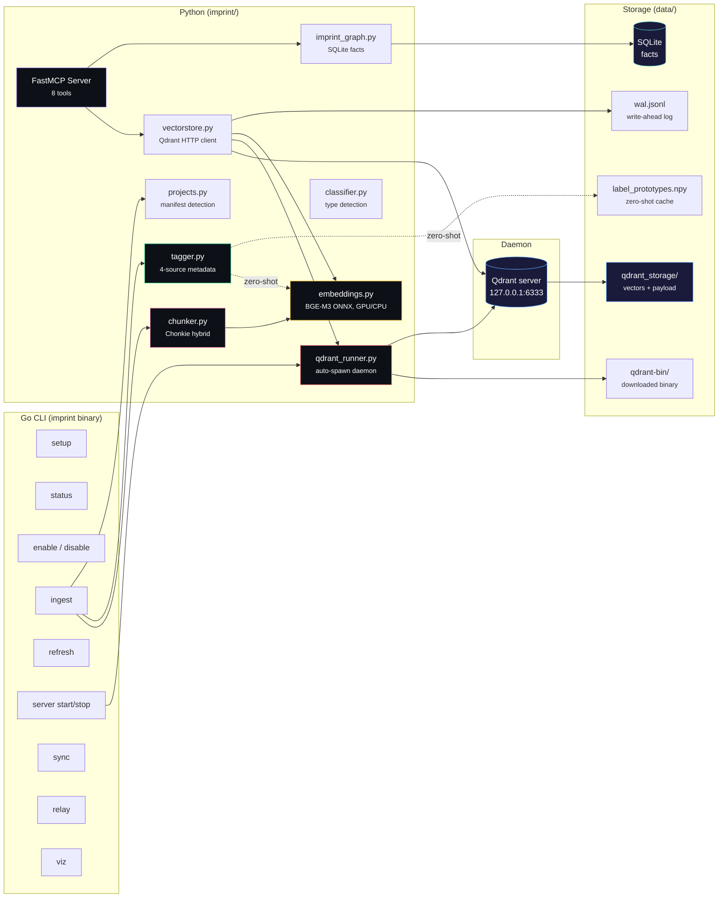

# Imprint Memory Layer

AI memory system for Claude Code. Gives Claude persistent memory across sessions — it remembers your projects, decisions, patterns, and conversations so you don't have to re-explain context every time.



## Install

**Linux / macOS:**
```bash
curl -fsSL https://raw.githubusercontent.com/alexandruleca/claude-code-memory-layer/main/install.sh | bash
```

**Windows (PowerShell):**
```powershell
irm https://raw.githubusercontent.com/alexandruleca/claude-code-memory-layer/main/install.ps1 | iex
```

This clones the repo, builds the binary, installs Python dependencies (including ONNX Runtime + Qdrant client + Chonkie), registers the MCP server, configures Claude Code hooks, and sets up shell aliases. One command, everything ready.

**GPU acceleration (optional):** install `onnxruntime-gpu` + CUDA 12 wheels (`pip install nvidia-cuda-runtime-cu12 nvidia-cublas-cu12 nvidia-cudnn-cu12 nvidia-cufft-cu12`) and the runtime auto-detects CUDA. See [GPU acceleration](#gpu-acceleration).

## Commands

```bash
imprint setup              # install deps, register MCP, configure Claude Code
imprint status             # is everything wired? show enabled/disabled, server pid, memory stats
imprint enable [target]    # re-wire MCP + hooks + start server (target: claude-code | cursor)
imprint disable            # stop server, unregister MCP, strip hooks (data preserved)
imprint ingest [dir]       # import memories + conversations [+ index projects]
imprint refresh <dir>      # re-index only changed files
imprint server <cmd>       # manage the local Qdrant daemon: start | stop | status | log
imprint sync serve --relay <host>  # expose KB for peer syncing
imprint sync <host>/<id>   # bidirectional sync with a peer
imprint relay              # run the sync relay server
imprint viz                # 3D brain cluster visualization
imprint version            # print version
```

**`disable` / `enable` are kill switches.** Disable stops the Qdrant daemon, removes the MCP server registration from Claude Code, and strips the imprint hooks from `~/.claude/settings.json`. Your venv and data directory are kept intact, so re-enabling is instant — no re-ingest needed. `imprint status` shows the current state.

Example status output:

```
═══ Imprint Status ═══

[+] ENABLED

  ✓ MCP server registered (Claude Code)
  ✓ Hooks installed (5 entries)
  ✓ Qdrant server  http://127.0.0.1:6333  (pid 19803)
  ✓ Python venv    /home/you/code/imprint/.venv/bin/python
  ✓ Data dir       /home/you/code/imprint/data

  Memories: 14293  across 32 projects
    my-web-app (1551)
    backend-api (1053)
    ...
```

## How It Works

### Data Flow



### How Embeddings Work

The system converts every chunk of text — code, markdown, conversation, decision — into a **1024-dimensional vector** that captures its meaning. Semantically similar text lands close together in vector space, which is what makes semantic search possible.



**Model:** [BAAI BGE-M3](https://huggingface.co/BAAI/bge-m3) (Apache 2.0). Best-in-class open embedding model — 568M params, 8192 token context, MTEB ~67. We use the [Xenova ONNX export](https://huggingface.co/Xenova/bge-m3) which ships int8/fp16/q4 variants.

**Variant selection** is automatic per device:

| Device | Variant | Why |
|---|---|---|
| GPU (CUDA) | `model_fp16.onnx` | Tensor cores prefer fp16; int8 falls back to CPU kernels on most GPUs |
| CPU | `model_int8.onnx` | Dynamic int8 quantization, 2–4× faster than fp32 with ~1% MTEB drop |

**Memory & speed safeguards** (set in [embeddings.py](imprint/embeddings.py)):

- ONNX `enable_cpu_mem_arena=False` + `enable_mem_pattern=False` — releases activations between calls instead of pinning a worst-case arena. Keeps RSS bounded on WSL2/low-RAM boxes.
- **Length-bucketed batching** in [`embed_documents_batch`](imprint/embeddings.py) — sorts chunks by length so each batch pads to the longest item in *its* bucket, not the global max. Critical because activation memory scales with `batch × seq_len`.
- **Per-batch `gc.collect()`** — drops intermediate tensors before the next iteration.
- **GPU VRAM cap** via `gpu_mem_limit` (default 6 GB) + `arena_extend_strategy=kSameAsRequested` — avoids the unbounded power-of-two arena growth that crashed WSL2 on long ingests.

**Why CLS pooling, not mean pooling?** BGE-M3 (XLM-RoBERTa backbone) is trained so the `[CLS]` token at position 0 is the sentence representation. Mean pooling works but loses ~2 MTEB points.

### How Chunking Works

Long files don't embed well as a single vector — the model has limited context, and one giant vector blurs together too many concepts. The chunker splits text into focused, retrieval-friendly pieces.



**[Chonkie](https://github.com/chonkie-inc/chonkie) hybrid dispatch** in [chunker.py](imprint/chunker.py):

- **`CodeChunker`** — tree-sitter parses the file into an AST and splits at function/class/method boundaries. Language-aware (Python, TypeScript, Go, Rust, Java, PHP, Ruby, Swift, C/C++, etc.) so it never cuts mid-function.
- **`SemanticChunker`** — embeds sentences with a tiny [Model2Vec](https://github.com/MinishLab/model2vec) static embedder, computes cosine similarity over a sliding window, and splits where similarity drops below `threshold=0.7`. Dynamic chunk size: a coherent topic stays together; a topic shift triggers a split.
- **Sliding overlap** — `IMPRINT_CHUNK_OVERLAP=400` chars from the tail of each chunk prepended to the next. Preserves boundary context so retrieval doesn't miss signal sitting right at a split.
- **Semantic subsplit for code** — oversized code chunks (>8000 chars) get secondary topic-shift splitting via SemanticChunker. Small focused functions stay whole; large functions split where the logic changes.

| Knob | Default | Effect |
|---|---|---|
| `IMPRINT_CHUNK_SIZE_CODE` | 4000 chars | Soft target for code (semantic subsplit above 2×) |
| `IMPRINT_CHUNK_SIZE_PROSE` | 6000 chars | Soft target for prose (topic-shift is primary boundary) |
| `IMPRINT_CHUNK_HARD_MAX` | 16000 chars | Absolute cap (~4k tokens, within BGE-M3's 8k context) |
| `IMPRINT_CHUNK_OVERLAP` | 400 chars | Sliding window between chunks |

### Metadata Tags (search & filter)

Every chunk gets a structured tag payload stored in Qdrant:

```python
{
    "lang":   "python",                 # from file extension
    "layer":  "api",                    # from path (api/ui/tests/infra/...)
    "kind":   "source",                 # source/test/migration/readme/types/...
    "domain": ["auth", "db"],           # keyword-matched topics
    "topics": ["jwt-validation", ...]   # opt-in: zero-shot or LLM-derived
}
```



**Always on (free, deterministic):**
- `derive_deterministic(rel_path)` — language from extension, layer from path segment matchers (api/, ui/, tests/, infra/, config/, migrations/, docs/, scripts/, cli/), kind from filename pattern (`test_*`, `migration_*`, `README.md`, `__init__.py`, ...).
- `derive_keywords(content)` — hand-rolled regex dict with 13 default domains: auth, db, api, math, rendering, ui, testing, infra, ml, perf, security, build, payments. See [tagger.py](imprint/tagger.py).

**Opt-in (cost extra compute / $$):**
- `IMPRINT_ZERO_SHOT_TAGS=1` — embed each chunk against pre-embedded label prototypes; cosine similarity > 0.35 wins. Adds one vector compare per chunk per label.
- `IMPRINT_LLM_TAGS=1` — calls Claude (`claude-haiku-4-5` by default, override via `IMPRINT_LLM_TAGGER_MODEL`) to suggest 1–4 topic tags. Needs `ANTHROPIC_API_KEY`.

**MCP search supports payload filters** — the model can narrow:

```python
mcp__imprint__search(
    query="JWT validation",
    lang="python",                  # tags.lang
    layer="api",                    # tags.layer
    domain="auth,security",         # any-match against tags.domain
    project="my-web-app",
    type="pattern",
    limit=10,
)
```

### Project Detection

When you run `imprint ingest ~/code`, it recursively finds real project roots by looking for manifest files — not just top-level directories:



| Manifest | Type | Name extracted from |
|---|---|---|
| `package.json` | Node.js | `name` field |
| `go.mod` | Go | `module` path |
| `pyproject.toml` / `setup.py` | Python | `name` field or dir name |
| `requirements.txt` | Python | directory name |
| `composer.json` | PHP | `name` field |
| `Cargo.toml` | Rust | `name` field |
| `pom.xml` / `build.gradle` | Java | directory name |
| `Gemfile` | Ruby | directory name |

Projects are identified by **canonical name** from the manifest, not the file path. The same project at different paths on different machines gets the same identity — this makes sync work across machines.

### MCP Tools

Claude Code gets 8 tools via the imprint MCP server:

| Tool | Purpose |
|------|---------|
| `wake_up` | Load prior context at session start (~800 tokens) |
| `search` | Semantic search with `project`/`type`/`lang`/`layer`/`kind`/`domain` filters |
| `store` | Save a memory — auto-classified as decision/pattern/bug/etc. |
| `delete` | Remove a memory by ID |
| `kg_add` | Add a temporal fact (subject → predicate → object) |
| `kg_query` | Query facts with optional time filtering |
| `kg_invalidate` | Mark a fact as no longer valid |
| `status` | Show memory count by project |

### Automatic Updates

The imprint memory stays current through three mechanisms:

- **Stop hook** (async) — after each Claude response, parses the conversation transcript, extracts Q+A exchanges and decision-like statements, stores them automatically with `lang=conversation` tags
- **PreCompact hook** (sync) — before Claude's context window gets compressed, blocks and instructs Claude to save all important context via MCP tools
- **`imprint refresh`** — compares file modification times via `vs.get_source_mtimes()`, only re-chunks + re-embeds what changed

### Concurrency: Auto-Spawned Local Server

Embedded Qdrant (the `path=...` mode) is single-writer — only one process can hold the on-disk lock. That breaks the moment your MCP server, your hooks, and a `imprint ingest` all try to write at once. Imprint sidesteps the limitation by **auto-spawning a local Qdrant server** on `127.0.0.1:6333`.



[`qdrant_runner.py`](imprint/qdrant_runner.py) handles the lifecycle:

- **First call**: downloads the pinned Qdrant binary (~50 MB) from GitHub releases into `data/qdrant-bin/`, then `subprocess.Popen([..., start_new_session=True])` so the daemon survives the parent process. Logs to `data/qdrant.log`, PID written to `data/qdrant.pid`.
- **Subsequent calls**: cheap HTTP probe to `/readyz` — returns immediately if alive.
- **Storage**: `data/qdrant_storage/` (collection data) + `data/qdrant_snapshots/`. Both gitignored.
- **Shutdown**: `imprint server stop` (or `imprint disable`) sends SIGTERM via the PID file.

| Env var | Default | Purpose |
|---|---|---|
| `IMPRINT_QDRANT_HOST` | `127.0.0.1` | Bind / connect host |
| `IMPRINT_QDRANT_PORT` | `6333` | HTTP port |
| `IMPRINT_QDRANT_GRPC_PORT` | `6334` | gRPC port |
| `IMPRINT_QDRANT_VERSION` | `v1.17.1` | Pinned release tag |
| `IMPRINT_QDRANT_BIN` | (auto) | Override binary path (e.g. system-installed qdrant) |
| `IMPRINT_QDRANT_NO_SPAWN` | `0` | Set `1` to disable auto-spawn — connect to your own managed server |

**Why server mode and not embedded?** Embedded mode pins a filesystem lock and rejects any second client — this conflicts with Claude Code (always-on MCP) running alongside `imprint ingest`, hooks writing decisions, and tools like `imprint viz` reading the collection. Server mode supports unlimited concurrent connections at the cost of a single ~50 MB binary in your data dir and a ~50 MB resident process. Worth it.

**Bring your own server**: set `IMPRINT_QDRANT_NO_SPAWN=1` and point `IMPRINT_QDRANT_HOST` at a Docker (`docker run -p 6333:6333 qdrant/qdrant`) or remote Qdrant. Auto-spawn is disabled and the runner connects directly.

### Lifecycle commands

```bash
imprint status            # is the system enabled? server pid? memory count?
imprint enable            # idempotent re-wire of MCP + hooks + server
imprint disable           # stops daemon, removes MCP registration, strips hooks
imprint server start      # explicit server boot (auto on first MCP/CLI call)
imprint server stop       # SIGTERM the daemon
imprint server status     # JSON: pid, host, port, log path
imprint server log        # path to qdrant.log for tailing
```

### Peer Sync



The relay server is a stateless WebSocket forwarder — deploy it on any server or your Docker Swarm cluster behind Traefik. Room IDs expire after 1 hour. Vectors are **not** transferred over the wire — peers re-embed content locally, which means a machine running BGE-M3 GPU and another on int8 CPU can sync without vector-format compatibility headaches.

```bash
# Self-host the relay
imprint relay --port 8430

# Machine A
imprint sync serve --relay sync.yourdomain.com
# → prints: imprint sync sync.yourdomain.com/abc123

# Machine B
imprint sync sync.yourdomain.com/abc123
# → bidirectional merge, done
```

### Visualization

```bash
imprint viz
```

Opens an Obsidian-style force-directed graph in a Chrome app window:
- Sigma.js WebGL renderer — handles 100k+ nodes at interactive framerates
- ForceAtlas2 layout clusters same-project nodes together organically
- Hover highlights node + direct neighbors (Obsidian-style dim/bright)
- Click opens rich detail panel: tags, metadata, related nodes with similarity %, content preview
- Search highlights matching nodes, filter by project via legend
- Real-time updates via SSE when the imprint memory changes
- Pan, zoom, drag nodes to rearrange

## GPU Acceleration

Embedding throughput on a 32-core CPU box maxes out around 1 doc/sec for BGE-M3 — sufficient for incremental refresh, slow for an initial 20k-file ingest. GPU is ~20× faster.

```bash
# Force GPU
IMPRINT_DEVICE=gpu imprint ingest ~/code

# Force CPU (e.g. on a headless box without CUDA)
IMPRINT_DEVICE=cpu imprint ingest ~/code

# Auto-detect (default) — uses GPU if onnxruntime-gpu + CUDAExecutionProvider available
imprint ingest ~/code
```

**Setup checklist (one-time):**

```bash
.venv/bin/pip install onnxruntime-gpu \
    nvidia-cuda-runtime-cu12 nvidia-cublas-cu12 nvidia-cudnn-cu12 \
    nvidia-cufft-cu12 nvidia-curand-cu12
```

The runtime [`_preload_cuda_libs()`](imprint/embeddings.py) dlopens the pip-installed CUDA libraries before constructing the ORT session, so you don't need `LD_LIBRARY_PATH` set at process start.

**Tunables:**

| Env var | Default | Notes |
|---|---|---|
| `IMPRINT_DEVICE` | `auto` | `auto` / `cpu` / `gpu` |
| `IMPRINT_GPU_MEM_MB` | `2048` | VRAM cap for ORT CUDA arena (WSL2-safe; raise on dedicated GPUs) |
| `IMPRINT_GPU_DEVICE` | `0` | CUDA device index |
| `IMPRINT_ONNX_THREADS` | `4` | CPU intra-op threads |
| `IMPRINT_MAX_SEQ_LENGTH` | `2048` | Token truncation cap |
| `IMPRINT_MODEL_NAME` | `Xenova/bge-m3` | HF repo |
| `IMPRINT_MODEL_FILE` | auto | Override variant pick |

## Architecture



| Component | Technology | Purpose |
|---|---|---|
| Vector store | Qdrant server (auto-spawned daemon) | HNSW + int8 scalar quantization, payload-indexed filters, multi-client safe |
| Server runner | `qdrant_runner.py` | Downloads + spawns + supervises the local Qdrant daemon |
| Embeddings | BGE-M3 via ONNX Runtime | 1024-dim, 8192 ctx, MTEB ~67. GPU (fp16) or CPU (int8) |
| Chunking | Chonkie 1.6+ | `CodeChunker` (tree-sitter) + `SemanticChunker` (topic shifts) + sliding overlap |
| Metadata tagger | Python | Deterministic + keyword dict + opt-in zero-shot + opt-in LLM |
| Imprint graph | SQLite | Temporal facts with valid_from/ended |
| MCP server | FastMCP (Python) | 8 tools — connects to Qdrant via HTTP |
| CLI | Go | `setup`, `status`, `enable`, `disable`, `ingest`, `refresh`, `server`, `sync`, `relay`, `viz` |
| Relay | Go (nhooyr/websocket) | Stateless WebSocket forwarder for P2P sync |

## Building from Source

```bash
make build        # current platform
make all          # cross-compile (linux, macOS, Windows)
```

## Docker (Relay Server)

```bash
docker build -t imprint-relay .
docker run -p 8430:8430 imprint-relay
```

Or deploy to Docker Swarm with `docker-compose.relay.yml`.

## Requirements

- Python 3.9+
- pip
- [Claude Code CLI](https://docs.anthropic.com/en/docs/claude-code/overview)
- (Optional) NVIDIA GPU + CUDA 12 for ONNX-GPU acceleration
