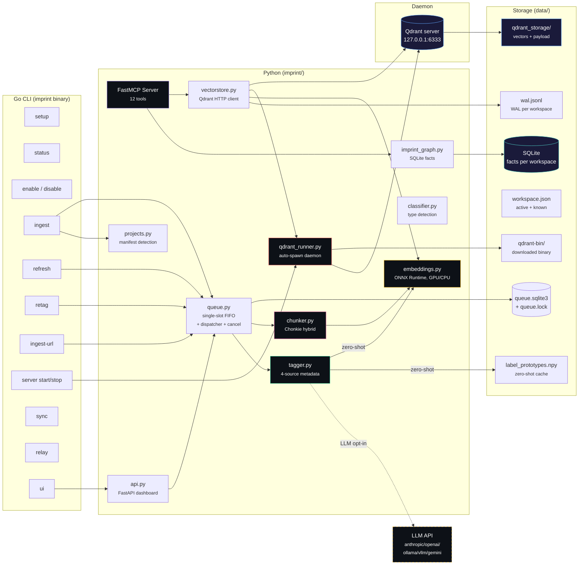
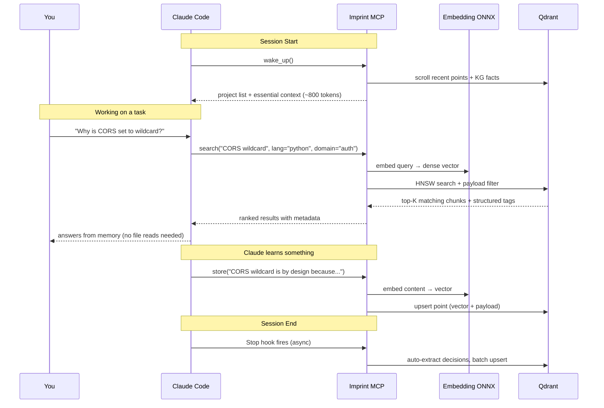
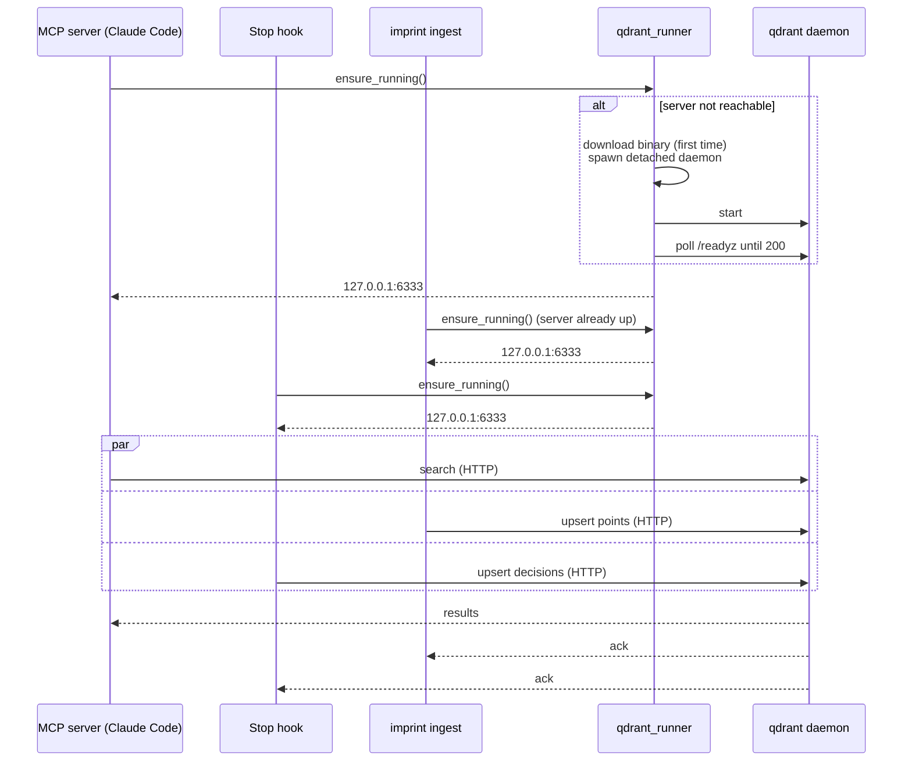

# Architecture

## Components



| Component | Technology | Purpose |
|---|---|---|
| Vector store | Qdrant server (auto-spawned daemon) | HNSW + int8 scalar quantization, payload-indexed filters, multi-client safe |
| Server runner | `qdrant_runner.py` | Downloads + spawns + supervises the local Qdrant daemon |
| Embeddings | EmbeddingGemma-300M via ONNX Runtime | 768-dim, 2048 ctx. Configurable model via `imprint config` |
| Chunking | Chonkie 1.6+ | `CodeChunker` (tree-sitter) + `SemanticChunker` (topic shifts) + sliding overlap |
| Metadata tagger | Python | Deterministic + keyword dict + zero-shot (default) + opt-in multi-provider LLM |
| Imprint graph | SQLite | Temporal facts with valid_from/ended |
| MCP server | FastMCP (Python) | 12 tools — `search`/`neighbors`/`graph_scope`/`list_sources`/`file_summary`/`file_chunks` for reads, `store`/`delete`/`ingest_url` for writes, `kg_query`/`kg_edit` for facts, `status` for stats. Connects to Qdrant via HTTP. |
| CLI | Go | `setup`, `status`, `enable`, `disable`, `update`, `uninstall`, `ingest`, `learn`, `ingest-url`, `refresh`, `refresh-urls`, `retag`, `migrate`, `server`, `workspace`, `wipe`, `sync`, `relay`, `ui`, `config` |
| Relay | Go (nhooyr/websocket) | Stateless WebSocket forwarder for P2P sync |
| Command queue | `imprint/queue.py` + `imprint/queue_lock.py` + `internal/queuelock` | Single-slot FIFO (SQLite at `data/queue.sqlite3`, advisory flock at `data/queue.lock`). Serializes heavy jobs across the Go CLI and the FastAPI dispatcher; cancel sends SIGTERM → SIGKILL (3s) to the subprocess process group. See [queue.md](queue.md). |

## Data Flow



## Concurrency: Auto-Spawned Local Server

Embedded Qdrant (the `path=...` mode) is single-writer — only one process can hold the on-disk lock. That breaks the moment your MCP server, your hooks, and an `imprint ingest` all try to write at once. Imprint sidesteps the limitation by **auto-spawning a local Qdrant server** on `127.0.0.1:6333`.



[`qdrant_runner.py`](../imprint/qdrant_runner.py) handles the lifecycle:

- **First call**: downloads the pinned Qdrant binary (~50 MB) from GitHub releases into `data/qdrant-bin/`, then `subprocess.Popen([..., start_new_session=True])` so the daemon survives the parent process. Logs to `data/qdrant.log`, PID written to `data/qdrant.pid`.
- **Subsequent calls**: cheap HTTP probe to `/readyz` — returns immediately if alive.
- **Storage**: `data/qdrant_storage/` (collection data) + `data/qdrant_snapshots/`. Both gitignored.
- **Shutdown**: `imprint server stop` (or `imprint disable`) sends SIGTERM via the PID file.

| Env var | Default | Purpose |
|---|---|---|
| `IMPRINT_QDRANT_HOST` | `127.0.0.1` | Bind / connect host |
| `IMPRINT_QDRANT_PORT` | `6333` | HTTP port |
| `IMPRINT_QDRANT_GRPC_PORT` | `6334` | gRPC port |
| `IMPRINT_QDRANT_VERSION` | `v1.17.1` | Pinned release tag |
| `IMPRINT_QDRANT_BIN` | (auto) | Override binary path (e.g. system-installed qdrant) |
| `IMPRINT_QDRANT_NO_SPAWN` | `0` | Set `1` to disable auto-spawn — connect to your own managed server |

**Why server mode and not embedded?** Embedded mode pins a filesystem lock and rejects any second client — this conflicts with Claude Code (always-on MCP) running alongside `imprint ingest`, hooks writing decisions, and tools like `imprint ui` reading the collection. Server mode supports unlimited concurrent connections at the cost of a single ~50 MB binary in your data dir and a ~50 MB resident process. Worth it.

**Bring your own server**: set `IMPRINT_QDRANT_NO_SPAWN=1` and point `IMPRINT_QDRANT_HOST` at a Docker (`docker run -p 6333:6333 qdrant/qdrant`) or remote Qdrant. Auto-spawn is disabled and the runner connects directly.

## Concurrency: Command Queue (OOM guard)

Ingest / refresh / retag / ingest-url each load the embedding model, scan Qdrant, and — when LLM tagging is enabled — hold a per-batch HTTP connection to the tagger provider. Two of them running in parallel on the same box easily exhaust RAM or VRAM, so they are serialized by a shared advisory lock.

- **Lock file**: `data/queue.lock` guarded by `fcntl.flock(LOCK_EX|LOCK_NB)`. The Go CLI (`internal/queuelock`) and the Python dispatcher (`imprint/queue_lock.py`) agree on the path and the JSON body (`{pid, job_id, command, started_at}`), so whichever process acquires it first blocks the other.
- **CLI semantics**: Direct invocations of `imprint ingest|refresh|retag|ingest-url|refresh-urls` try the lock non-blocking. If held, they exit nonzero and print the current holder's PID, command, and start time — the user cancels from the UI or `kill`s the PID.
- **UI semantics**: `POST /api/commands/{cmd}` enqueues into `data/queue.sqlite3`; the FastAPI startup task (`queue.dispatcher_loop`) pops one queued row at a time, waits blocking on the lock, then `Popen`s the subprocess with `start_new_session=True` so the child owns its own process group.
- **Cancel**: `POST /api/jobs/{id}/cancel` either marks a queued row `cancelled` (dispatcher skips it) or, for a running job, fires `killpg(pgid, SIGTERM)` followed 3 s later by `SIGKILL` if the group is still alive. Because the child runs in its own session, the escalation reaps the Python subprocess, its httpx worker threads (so the in-flight LLM tagger call drops), any `llama-cpp` inference thread, and any descendant `git ls-files` helpers — all together.
- **Restart recovery**: `queue.recover_on_startup()` marks rows in `status='running'` whose PID is dead as `failed` (`error='api_restart'`) and clears stale lock files, so the dispatcher resumes cleanly after an API crash.
- **Progress integration**: `imprint/progress.py` keeps its single-slot `ingest_progress.json`; `/api/queue` joins it with the active DB row so the UI still sees phase/processed/total/ETA while gaining queue/position/history.

See [queue.md](queue.md) for endpoint reference, SQLite schema, and verification steps.

## Lifecycle Commands

```bash
imprint status            # is the system enabled? server pid? memory count?
imprint enable            # idempotent re-wire of MCP + hooks + server
imprint disable           # stops daemon, removes MCP registration, strips hooks
imprint server start      # explicit server boot (auto on first MCP/CLI call)
imprint server stop       # SIGTERM the daemon
imprint server status     # JSON: pid, host, port, log path
imprint server log        # path to qdrant.log for tailing
```

**`disable` / `enable` are kill switches.** Disable stops the Qdrant daemon, removes the MCP server registration from Claude Code, and strips the imprint hooks from `~/.claude/settings.json`. Your venv and data directory are kept intact, so re-enabling is instant — no re-ingest needed. `imprint status` shows the current state.

Example status output:

```
═══ Imprint Status ═══

[+] ENABLED

  ✓ MCP server registered (Claude Code)
  ✓ Hooks installed (5 entries)
  ✓ Qdrant server  http://127.0.0.1:6333  (pid 19803)
  ✓ Python venv    /home/you/code/imprint/.venv/bin/python
  ✓ Data dir       /home/you/code/imprint/data

  Memories: 14293  across 32 projects
    my-web-app (1551)
    backend-api (1053)
    ...
```
