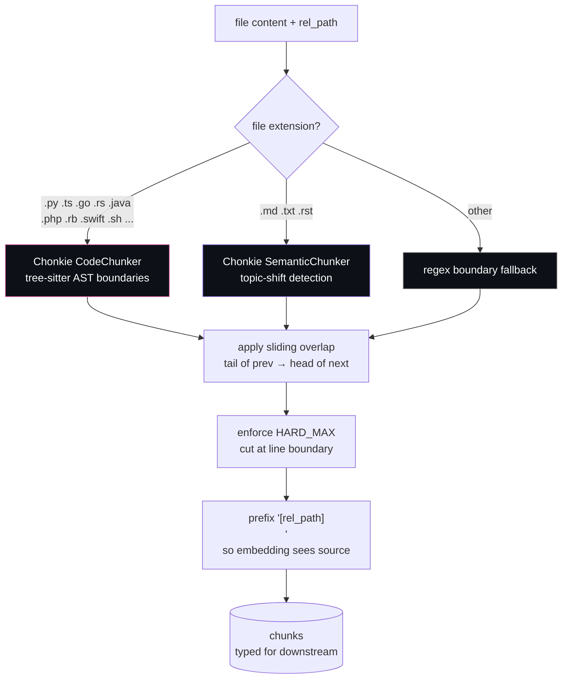

# Chunking

Long files don't embed well as a single vector — the model has limited context, and one giant vector blurs together too many concepts. The chunker splits text into focused, retrieval-friendly pieces.

**[Chonkie](https://github.com/chonkie-inc/chonkie) hybrid dispatch** in [chunker.py](../imprint/chunker.py):

- **`CodeChunker`** — tree-sitter parses the file into an AST and splits at function/class/method boundaries. Language-aware (Python, TypeScript, Go, Rust, Java, PHP, Ruby, Swift, C/C++, etc.) so it never cuts mid-function.
- **`SemanticChunker`** — embeds sentences with a tiny [Model2Vec](https://github.com/MinishLab/model2vec) static embedder, computes cosine similarity over a sliding window, and splits where similarity drops below `chunker.semantic_threshold` (default `0.5`). Lower = sharper splits / more chunks, higher = fewer, broader chunks. Dynamic chunk size: a coherent topic stays together; a topic shift triggers a split.
- **Sliding overlap** — `IMPRINT_CHUNK_OVERLAP=400` chars from the tail of each chunk prepended to the next. Preserves boundary context so retrieval doesn't miss signal sitting right at a split.
- **Semantic subsplit for code** — oversized code chunks (>8000 chars) get secondary topic-shift splitting via SemanticChunker. Small focused functions stay whole; large functions split where the logic changes.

| Knob | Default | Effect |
|---|---|---|
| `IMPRINT_CHUNK_SIZE_CODE` | 4000 chars | Soft target for code (semantic subsplit above 2×) |
| `IMPRINT_CHUNK_SIZE_PROSE` | 6000 chars | Soft target for prose (topic-shift is primary boundary) |
| `IMPRINT_CHUNK_HARD_MAX` | 8000 chars | Absolute cap (~2k tokens, fits within 2048 token context) |
| `IMPRINT_CHUNK_OVERLAP` | 400 chars | Sliding window between chunks |

Full setting names for persistence via `imprint config set`: `chunker.size_code`, `chunker.size_prose`, `chunker.hard_max`, `chunker.overlap`, `chunker.semantic_threshold`. See [configuration.md](./configuration.md).
