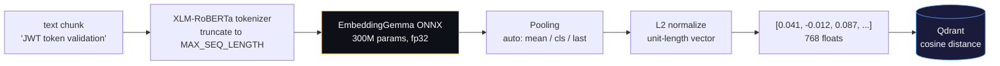

The system converts every chunk of text — code, markdown, conversation, decision — into a dense vector (768-dim by default) that captures its meaning. Semantically similar text lands close together in vector space, which is what makes semantic search possible.



**Default model:** [Google EmbeddingGemma-300M](https://huggingface.co/google/embeddinggemma-300m) — 300M params, 768-dim, 2048 token context, trained on 100+ languages from Gemma 3. We use the [ONNX Community export](https://huggingface.co/onnx-community/embeddinggemma-300m-ONNX). Supports fp32, q8, and q4 (no fp16).

> **License note**: EmbeddingGemma weights are governed by the [Gemma Terms of Use](https://ai.google.dev/gemma/terms) and [Prohibited Use Policy](https://ai.google.dev/gemma/prohibited_use_policy), not Apache/MIT. Imprint does not bundle the weights — they're downloaded at runtime from HuggingFace, where you accept Gemma's terms. If you switch to a different model (e.g. BGE-M3, MIT-licensed) you're on that model's license instead.

**Alternative:** [BAAI BGE-M3](https://huggingface.co/BAAI/bge-m3) — 568M params, 1024-dim, 8192 token context. Switch via `imprint config set model.name Xenova/bge-m3 && imprint config set model.dim 1024`.

Swap to any HuggingFace ONNX model via `imprint config set model.name <repo>` — set `model.dim` and `model.seq_length` to match.

**Pooling** is configurable (`imprint config set model.pooling <strategy>`): `auto` (default — picks per model), `cls` (BGE-M3), `mean`, `last`. If the ONNX model returns pre-pooled 2D output, pooling is skipped automatically.

**Memory & speed safeguards** (set in [embeddings.py](../imprint/embeddings.py)):

- ONNX `enable_cpu_mem_arena=False` + `enable_mem_pattern=False` — releases activations between calls instead of pinning a worst-case arena. Keeps RSS bounded on WSL2/low-RAM boxes.
- **Length-bucketed batching** in [`embed_documents_batch`](../imprint/embeddings.py) — sorts chunks by length so each batch pads to the longest item in *its* bucket, not the global max. Critical because activation memory scales with `batch × seq_len`.
- **Per-batch `gc.collect()`** — drops intermediate tensors before the next iteration.
- **GPU VRAM cap** via `gpu_mem_limit` (default 2 GB) + `arena_extend_strategy=kSameAsRequested` — avoids the unbounded power-of-two arena growth that crashed WSL2 on long ingests.

## GPU Acceleration

Embedding throughput on CPU is sufficient for incremental refresh but slow for initial large ingests. GPU is ~20× faster.

```bash
# Force GPU
IMPRINT_DEVICE=gpu imprint ingest ~/code

# Force CPU (e.g. on a headless box without CUDA)
IMPRINT_DEVICE=cpu imprint ingest ~/code

# Auto-detect (default) — uses GPU if onnxruntime-gpu + CUDAExecutionProvider available
imprint ingest ~/code
```

**Setup checklist (one-time):**

```bash
.venv/bin/pip install onnxruntime-gpu \
    nvidia-cuda-runtime-cu12 nvidia-cublas-cu12 nvidia-cudnn-cu12 \
    nvidia-cufft-cu12 nvidia-curand-cu12
```

The runtime [`_preload_cuda_libs()`](../imprint/embeddings.py) dlopens the pip-installed CUDA libraries before constructing the ORT session, so you don't need `LD_LIBRARY_PATH` set at process start.

**Tunables** (also configurable via `imprint config set model.*` — full list in [configuration.md](./configuration.md)):

| Setting key | Default | Notes |
|---|---|---|
| `model.device` | `auto` | `auto` / `cpu` / `gpu` |
| `model.gpu_mem_mb` | `2048` | VRAM cap for ORT CUDA arena (WSL2-safe; raise on dedicated GPUs) |
| `model.gpu_device` | `0` | CUDA device index |
| `model.threads` | `4` | CPU intra-op threads |
| `model.batch_size` | `0` (auto) | Embedding batch size. `0` = auto (32 on GPU, 16 on CPU). Raise on dedicated GPUs for faster ingest. |
| `model.seq_length` | `2048` | Token truncation cap |
| `model.name` | `onnx-community/embeddinggemma-300m-ONNX` | HF repo (any HuggingFace ONNX model) |
| `model.dim` | `768` | Embedding dimension (must match model) |
| `model.file` | auto | Override variant pick |
| `model.pooling` | auto | Pooling: auto / cls / mean / last |
