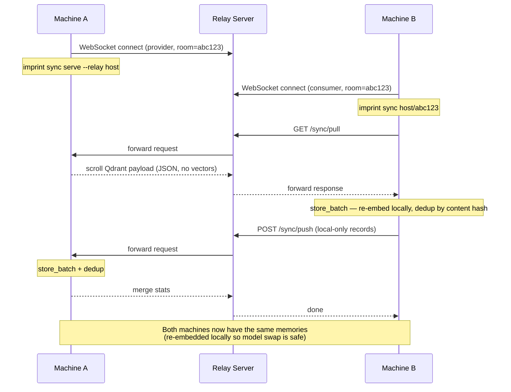

# Peer Sync & Visualization

## Peer Sync



The relay server is a stateless WebSocket forwarder — deploy it on any server or your Docker Swarm cluster behind Traefik. Room IDs expire after 1 hour. Vectors are **not** transferred over the wire — peers re-embed content locally, which means machines using different models or devices can sync without vector-format compatibility headaches.

```bash
# Self-host the relay
imprint relay --port 8430

# Machine A
imprint sync serve --relay sync.yourdomain.com
# → prints: imprint sync sync.yourdomain.com/abc123

# Machine B
imprint sync sync.yourdomain.com/abc123
# → bidirectional merge, done
```

Prebuilt relay images are on GHCR — see [installation.md](./installation.md#run-the-relay-server-docker) for Docker run commands.

## Visualization

```bash
imprint viz
```

Opens an Obsidian-style force-directed graph in a Chrome app window:
- Sigma.js WebGL renderer — handles 100k+ nodes at interactive framerates
- ForceAtlas2 layout clusters same-project nodes together organically
- Hover highlights node + direct neighbors (Obsidian-style dim/bright)
- Click opens rich detail panel: tags, metadata, related nodes with similarity %, content preview
- Search highlights matching nodes, filter by project via legend
- Real-time updates via SSE when the imprint memory changes
- Pan, zoom, drag nodes to rearrange
