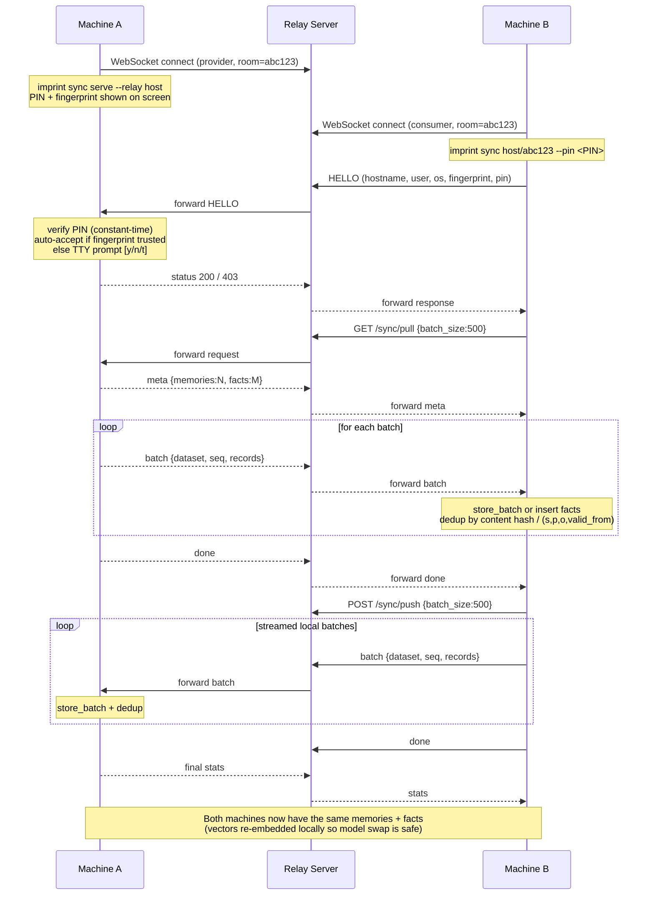

# Peer Sync & Visualization

## Peer Sync



The relay server is a stateless WebSocket forwarder. A public relay is hosted at `wss://imprint.alexandruleca.com` and used by default — pass `--relay` to point at your own. Room IDs expire after 1 hour.

**What transfers:**

- Qdrant payloads (content + metadata) — streamed in batches, deduped on import via SHA-256 content hash (`project:source:content[:200]`).
- Knowledge graph facts (SQLite `facts` table) — streamed in batches, deduped by `(subject, predicate, object, valid_from)`.
- **Not** transferred: vectors (peers re-embed locally so different models/devices stay compatible), WAL, config, trust list, other workspaces.

**Payload framing:** messages are newline-delimited JSON — `{"kind":"meta",...}`, `{"kind":"batch","dataset":"memories"|"facts","seq":N,"records":[...]}`, `{"kind":"done"}`. Default batch size is 500 records; override with `batch_size` in the request body. All three WS sockets (provider, consumer, relay) disable the nhooyr 32 KiB read cap so multi-MB batches flow without truncation.

### Choosing a relay

| Form | Example | Meaning |
|------|---------|---------|
| _(omit `--relay`)_ | `imprint sync serve` | Use default `wss://imprint.alexandruleca.com` |
| Bare host | `--relay sync.example.com` | Auto-pick scheme (`wss` unless localhost/127.*) |
| Explicit WSS | `--relay wss://sync.example.com` | Force `wss://` |
| Plain WS | `--relay ws://localhost:8430` | Force `ws://` (useful for local testing) |

The consumer accepts the same forms: a bare room ID uses the default relay; `<host>/<id>` or `wss://<host>/<id>` targets a specific relay.

### Authentication

Two factors gate every sync:

1. **PIN** — 8-char random alphanumeric (uppercase + lowercase + digits), freshly generated per `sync serve` session. Always required, even for previously trusted devices. Compared in constant time on the provider.
2. **Device fingerprint** — stable 8-char hex ID persisted at `data/device_id.txt`. Each machine has one. The provider prompts the user to accept an unknown fingerprint; trusted fingerprints (stored in `data/trusted_devices.json`) are auto-accepted after PIN check.

Prompt options on the provider side:
- `y` / `yes` — accept this session only
- `t` / `trust` — accept and remember the fingerprint
- anything else — reject

The relay sees neither the PIN nor the data — it only forwards opaque WebSocket frames between peers in a room.

```bash
# Use the default public relay
imprint sync serve
# → prints: imprint sync abc123 --pin Ab3xY9Kq
# → also prints: This device: hostname (id: a3f2c1d4)

imprint sync abc123 --pin Ab3xY9Kq          # Machine B, default relay

# Or self-host the relay
imprint relay --port 8430

imprint sync serve --relay sync.yourdomain.com
# → prints: imprint sync wss://sync.yourdomain.com/abc123 --pin Ab3xY9Kq

imprint sync wss://sync.yourdomain.com/abc123 --pin Ab3xY9Kq
# → Machine A sees hostname/user/os/fingerprint + prompts [y/n/t]
# → on accept: bidirectional merge, done
```

Prebuilt relay images are on GHCR — see [installation.md](./installation.md#run-the-relay-server-docker) for Docker run commands.

## Dashboard

```bash
imprint ui
```

Opens the Imprint dashboard (FastAPI + Next.js) with memory browsing, search, stats, and chat.
