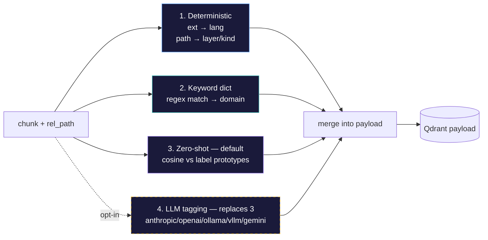

# Metadata Tagging

Every chunk gets a structured tag payload stored in Qdrant:

```python
{
    "lang":   "python",                 # from file extension
    "layer":  "api",                    # from path (api/ui/tests/infra/...)
    "kind":   "source",                 # source/test/migration/readme/types/...
    "domain": ["auth", "db"],           # keyword-matched topics
    "topics": ["jwt-validation", ...]   # zero-shot (default) or LLM-derived
}
```



Four tag sources, layered from cheap to rich:

| # | Source | What it produces | Cost | Default |
|---|--------|-----------------|------|---------|
| 1 | **Deterministic** | `lang` (from extension), `layer` (from path), `kind` (from filename) | Free | Always on |
| 2 | **Keyword dict** | `domain[]` — 13 categories via regex: auth, db, api, math, rendering, ui, testing, infra, ml, perf, security, build, payments | Free | Always on |
| 3 | **Zero-shot** | `topics[]` — cosine similarity against pre-embedded label prototypes (threshold > 0.35) | 1 vector compare per chunk per label | **On by default** (opt-out: `IMPRINT_ZERO_SHOT_TAGS=0`) |
| 4 | **LLM tagging** | `topics[]` — 1–4 tags per chunk from an LLM | 1 API call per chunk | Opt-in (`IMPRINT_LLM_TAGS=1`), **replaces** zero-shot |

When LLM tagging is enabled it replaces zero-shot — no point running both. See [tagger.py](../imprint/tagger.py) for implementation.

## LLM Tagger Providers

Set `IMPRINT_LLM_TAGS=1` and pick a provider:

| Provider | `IMPRINT_LLM_TAGGER_PROVIDER` | Default model | API key env var | Notes |
|---|---|---|---|---|
| Anthropic | `anthropic` (default) | `claude-haiku-4-5` | `ANTHROPIC_API_KEY` | Uses native Anthropic SDK |
| OpenAI | `openai` | `gpt-4o-mini` | `OPENAI_API_KEY` | OpenAI SDK |
| Gemini | `gemini` | `gemini-2.0-flash` | `GOOGLE_API_KEY` | Via OpenAI-compatible endpoint |
| Ollama | `ollama` | `llama3.2` | — | Local server, no API key needed |
| vLLM | `vllm` | `default` | — | Local server, no API key needed |
| Local (llama-cpp) | `local` | `qwen3-1.7b` (auto GGUF download) | — | In-process via `llama-cpp-python`, no server required. Tune via `tagger.local.model_repo`, `tagger.local.model_file`, `tagger.local.model_path`, `tagger.local.n_ctx`, `tagger.local.n_gpu_layers` |

**Overrides:**

| Env var | Purpose | Example |
|---|---|---|
| `IMPRINT_LLM_TAGGER_MODEL` | Use a different model | `IMPRINT_LLM_TAGGER_MODEL=llama3.1:70b` |
| `IMPRINT_LLM_TAGGER_BASE_URL` | Custom API endpoint | `IMPRINT_LLM_TAGGER_BASE_URL=http://gpu-box:8000/v1` |
| `IMPRINT_LLM_TAGGER_API_KEY` | Fallback API key (for providers without a standard env var) | — |

Ollama and vLLM use OpenAI-compatible APIs internally. Point `IMPRINT_LLM_TAGGER_BASE_URL` at any OpenAI-compatible server to use unlisted providers.

**MCP `store` always LLM-tags.** When a memory is saved via the `store` MCP tool, the background job runs the LLM tagger regardless of the `tagger.llm` config flag and stamps `llm_tagged: true` on the point so a later `imprint retag` won't re-tag it. The global toggle still controls ingest/refresh passes over bulk files.

## Search Filters

MCP search supports payload filters — the model can narrow:

```python
mcp__imprint__search(
    query="JWT validation",
    lang="python",                  # tags.lang
    layer="api",                    # tags.layer
    domain="auth,security",         # any-match against tags.domain
    project="my-web-app",
    type="pattern",
    limit=10,
)
```

See [mcp.md](./mcp.md) for the full MCP tool surface.
