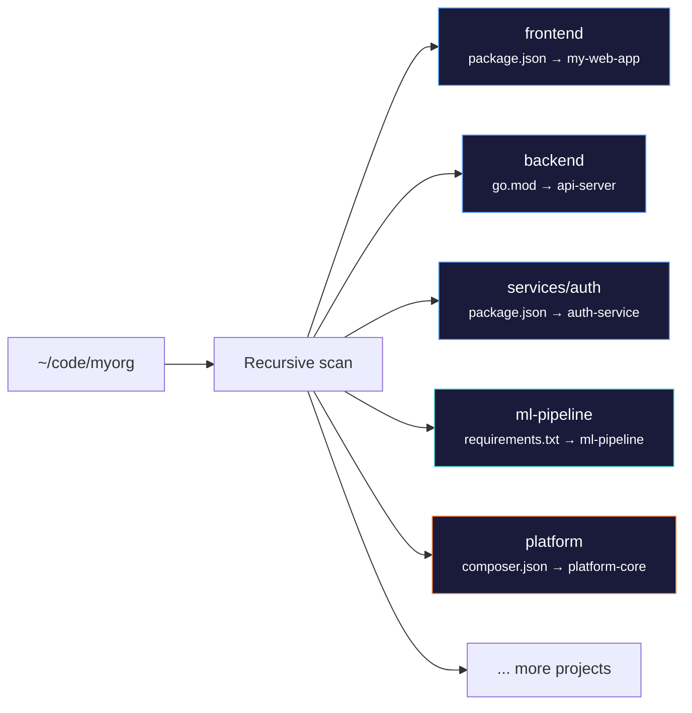
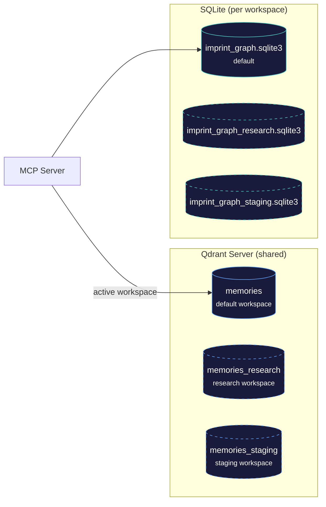

## Project Detection

When you run `imprint ingest ~/code`, it recursively finds real project roots by looking for manifest files — not just top-level directories:



| Manifest | Type | Name extracted from |
|---|---|---|
| `package.json` | Node.js | `name` field |
| `go.mod` | Go | `module` path |
| `pyproject.toml` / `setup.py` | Python | `name` field or dir name |
| `requirements.txt` | Python | directory name |
| `composer.json` | PHP | `name` field |
| `Cargo.toml` | Rust | `name` field |
| `pom.xml` / `build.gradle` | Java | directory name |
| `Gemfile` | Ruby | directory name |

Projects are identified by **canonical name** from the manifest, not the file path. The same project at different paths on different machines gets the same identity — this makes sync work across machines.

## Workspaces

Workspaces provide isolated memory environments. Each workspace gets its own Qdrant collection, SQLite knowledge graph, and write-ahead log — complete data isolation on the same Qdrant server.



**Default workspace** (`default`) uses the same file and collection names as before — zero migration. Existing data is automatically in the default workspace.

```bash
# List workspaces
imprint workspace
#   default (active)

# Create and switch to a new workspace
imprint workspace switch research
#   [+] created and switched to workspace: research

# Ingest into the active workspace — data goes to `memories_research` collection
imprint ingest ~/code/research-project

# Switch back
imprint workspace switch default

# Delete a workspace (must not be active)
imprint workspace delete research
```

**Naming rules:** lowercase alphanumeric + hyphens, max 40 characters, must start with letter or digit.

**Data per workspace:**

| Workspace | Collection | SQLite | WAL |
|---|---|---|---|
| `default` | `memories` | `imprint_graph.sqlite3` | `wal.jsonl` |
| `research` | `memories_research` | `imprint_graph_research.sqlite3` | `wal_research.jsonl` |

**Wipe behavior:**

```bash
imprint wipe                       # wipe active workspace only (via API — no server restart)
imprint wipe --workspace research  # wipe a specific workspace
imprint wipe --all                 # stop Qdrant, delete all data, restart fresh
```

The MCP server detects workspace changes dynamically — if you run `imprint workspace switch` in a terminal, the next MCP tool call picks up the new workspace automatically. Config is stored in `data/workspace.json`.
